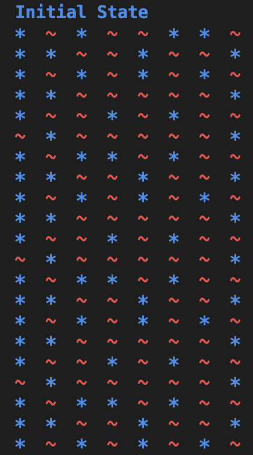

# Game of Life - 1D

This project is a simple implementation of a one-dimensional cellular automaton inspired by Conway's Game of Life. The simulation works on a single row of cells where each cell can be either alive or dead. Through a series of iterations, the state of each cell is updated based on the number of alive neighbors around it.

## Overview

In this version of the Game of Life, the evolution of the system is governed by custom rules:

- **Cell States:**
  - **DEAD**: Represented by `*` and printed in blue.
  - **ALIVE**: Represented by `~` and printed in red.

- **Color Output:**
  - The simulation uses ANSI escape codes to color the output:
    - Red for alive cells.
    - Blue for dead cells.

- **Neighbor Counting:**
  - Two neighbor counting functions are provided:
    - `nu_alive_cells`: Counts alive neighbors using a circular array (handles overflow with modulo arithmetic).
    - `nu_alive_cells_v2`: Counts alive neighbors only within valid indexes (does not wrap around).
  - By default, `nu_alive_cells_v2` is used in the evolution process.

- **Evolution Rules:**
  - **For an ALIVE cell:**
    - It survives if the number of alive neighbors is **2** or **4**; otherwise, it dies.
  - **For a DEAD cell:**
    - It becomes alive if the number of alive neighbors is **2** or **3**; otherwise, it remains dead.
    
- **Recursive Evolution:**
  - The `step` function recursively updates the state of the row for a specified number of iterations, printing the row at each step.

## How It Works

1. **Initialization:**
   - The program defines several test cases—each test case is a list representing an initial row of cells.

2. **Displaying the Row:**
   - The `pretty_print` function prints the current state of the row. It uses color coding to differentiate between alive and dead cells.

3. **Neighbor Calculation:**
   - Depending on your preference, you can use either neighbor function:
     - `nu_alive_cells` for a circular (wrap-around) behavior.
     - `nu_alive_cells_v2` for a non-wrapping version.
   - Comments in the code indicate how to adjust or swap between these functions for different patterns.

4. **State Update:**
   - The `step` function applies the evolution rules to each cell based on its number of alive neighbors and recursively processes the row for a given number of iterations.

5. **Execution:**
   - The `main` function runs through each test case, displaying the evolution of the cellular automaton for 20 iterations.

### 1D game of life
- input: [DEAD, ALIVE, DEAD, ALIVE, ALIVE, DEAD, DEAD, ALIVE]
  
	