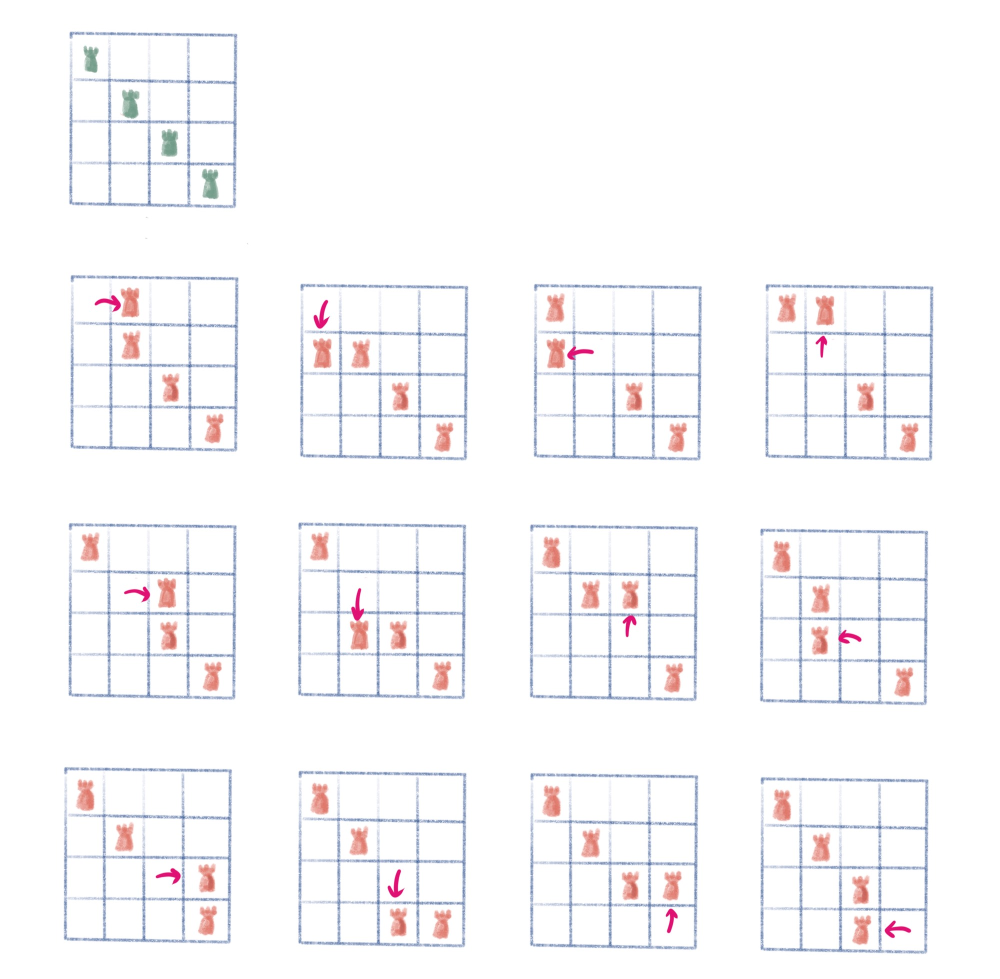
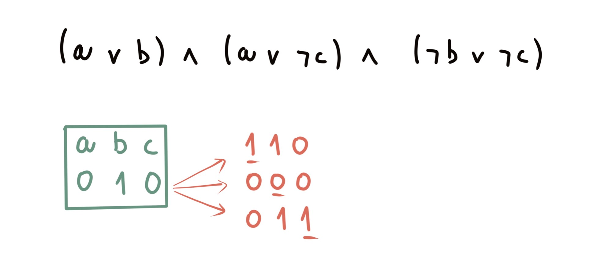
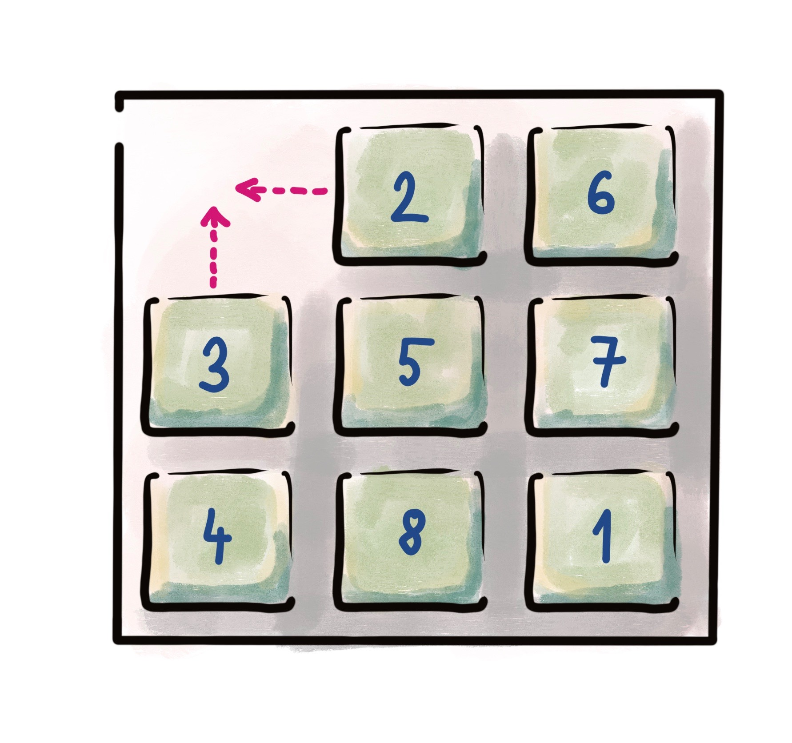
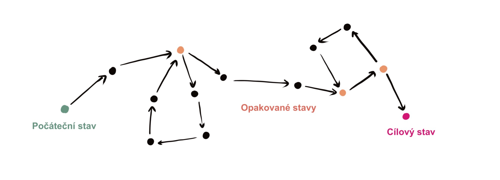
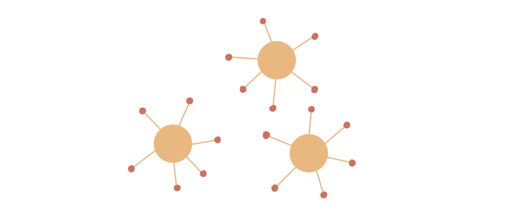
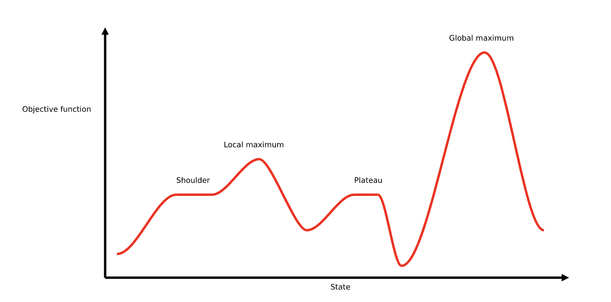
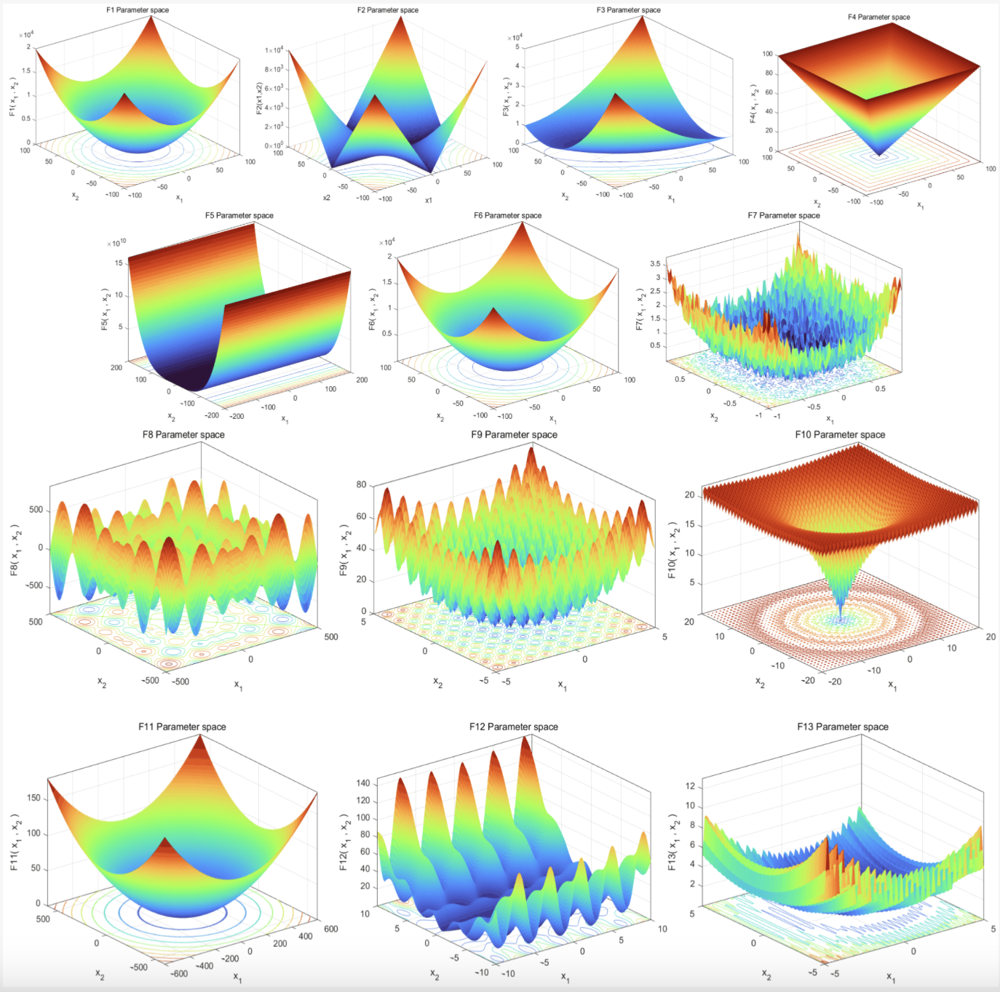
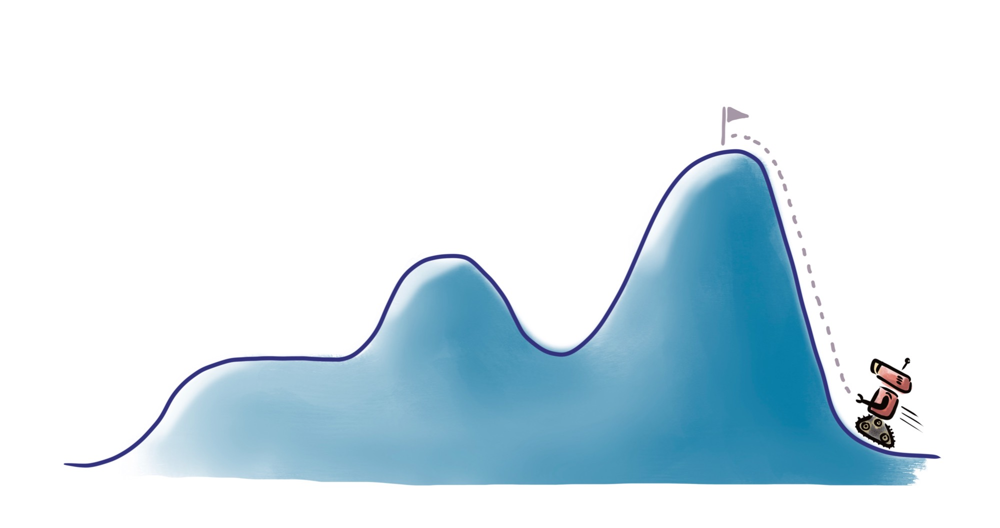
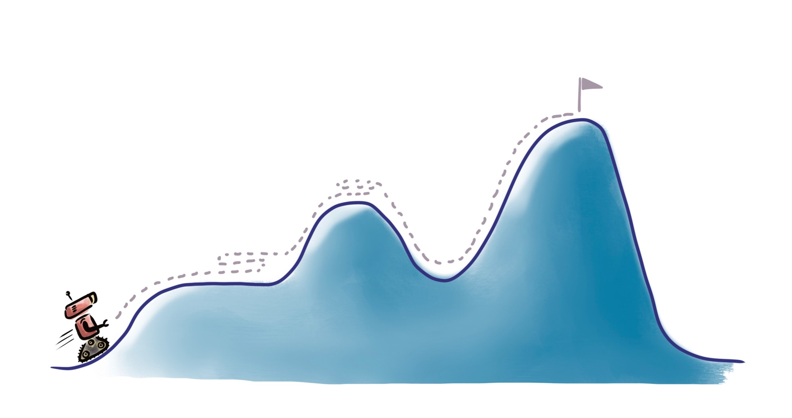
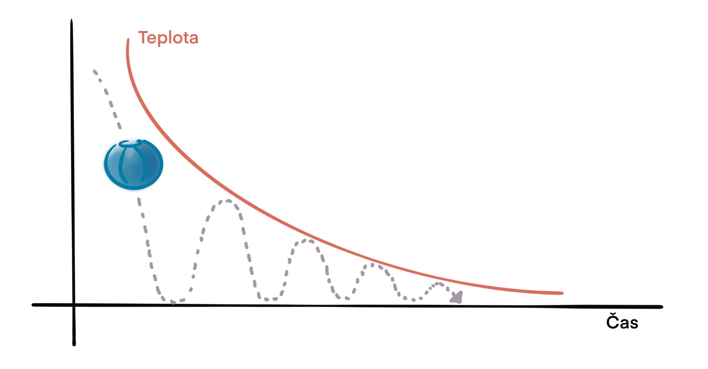

# Lokálne prehľadávanie 🔍🚀

Prednáška sa zameriava na techniky, ktoré riešia problémy pomocou hľadania v lokálnom okolí aktuálneho stavu, namiesto globálneho vyhľadávania celej množiny možných stavov.

## Úvod 📚

V mnohých úlohách umelej inteligencie je možné formulovať riešenie ako hľadanie správnej sekvencie krokov, ktoré vedú k požadovanému cieľu 🎯. Napríklad, hľadáme:
- stratégiu v hre,
- cestu zo štartu do cieľa,
- riešenie problému definovaného omezujúcimi podmienkami.

Pri lokálnom prehľadávaní sa nevenujeme všetkým možným stavom naraz, ale len určitej lokálnej oblasti okolo aktuálneho stavu, čo výrazne zjednodušuje a urýchľuje proces hľadania ⚡.

## Základné pojmy ✨

- **Aktuálny stav:**  
  Momentálna konfigurácia riešeného problému. Na začiatku je tento stav typicky inicializovaný náhodne, takže z počiatočného stavu väčšinou nevznikne okamžité riešenie 🤔.

- **Susedný stav:**  
  Stav, do ktorého sa z aktuálneho stavu dostaneme vykonaním jednej atómovej zmeny – teda krokom, ktorý mení iba malú časť konfigurácie 🔄.

- **Okolie aktuálneho stavu:**  
  Súbor všetkých stavov, do ktorých sa dá dostať jedným krokom. Cieľom lokálneho prehľadávania je vybrať taký stav z tohto okolia, ktorý nás priblíži k celkovému riešeniu 🏞️.

## Príklady problémov 📌

V prednáške sme si ukázali niekoľko príkladov problémov, ktoré je možné riešiť lokálnym prehľadávaním:

- **Problém N dám:**  
  Úlohou je umiestniť N dám na šachovnicu (N x N) tak, aby sa navzájom neohrozovali (dáma ohrozuje po riadkoch, stĺpcoch aj diagonálach) ♛.

- **SAT problém:**  
  Nájsť ohodnotenie pre logickú formulu v konjunktívnej normálnej forme, kde cieľom je splniť všetky klauzuly 💻.

- **Farebnosť grafu:**  
  Úloha nájsť obarvenie grafu s N vrcholmi tak, aby žiadne dve susedné vrcholy nemali rovnakú farbu 🎨.

- **Loydova osmica:**  
  Posúvanie kociek v osmičke tak, aby sa dosiahlo správne usporiadanie čísel s prázdnym miestom na konci 🎲.

## Lokálne prehľadávanie v praxi 🔍

Pri lokálnom prehľadávaní pracujeme s okolitými stavmi aktuálneho stavu. Cieľom je identifikovať medzistavy, ktoré obsahujú aspoň časti riešenia, a postupne ich vylepšovať, až kým nedosiahneme kompletné a validné riešenie. Výber ďalšieho stavu z okolia je kľúčový a ovplyvňuje efektivitu celého prehľadávania 🚀.

### Náhodná prechádzka 🎲

- **Popis:**  
  Najjednoduchšia metóda lokálneho prehľadávania, kde sa z aktuálneho stavu náhodne vyberie jeden zo susedných stavov.
- **Algoritmus:**
  1. Náhodne inicializovať aktuálny stav.
  2. Dokým nie je nájdené riešenie alebo nedosiahnutý maximálny počet krokov, opakovať:
     - Vybrať náhodný stav z okolia aktuálneho stavu.
- **Poznámka:**  
  Táto metóda je jednoduchá, ale môže trvať dlhšie, pretože často vedie k opakovaniu rovnakých stavov 🔄.

### Hill Climbing 🧗

- **Popis:**  
  Technika, ktorá využíva informáciu o kvalite jednotlivých stavov. Z okolia aktuálneho stavu sa vyberie ten najlepšie hodnotený, ktorý je aspoň rovnako dobrý ako súčasný.
- **Algoritmus:**
  1. Náhodne inicializovať aktuálny stav.
  2. Z okolia aktuálneho stavu vybrať stav s najvyšším skóre (podľa zvolenej heuristiky).
- **Výhody a nevýhody:**  
  Hill Climbing môže rýchlo viesť k riešeniu, no často sa zasekne v lokálnom optime, kde žiadny susedný stav nie je lepší ⛰️.

### Paprskové prehľadávanie 🔦

- **Popis:**  
  Vylepšenie hill climbing, kde namiesto jedného počiatočného stavu pracujeme s viacerými (napríklad K aktuálnymi stavmi). Z okolia týchto stavov sa vyberie K najlepších kandidátov, čo môže viesť k efektívnejšiemu prehľadávaniu celého priestoru riešení.
- **Poznámka:**  
  Tento prístup nie je úplne paralelný hill climbingom, pretože najlepšie stavy môžu pochádzať zo susedov jedného z aktuálnych stavov ⚡.

## Problémy lokálneho prehľadávania 🚧

### Lokálne optimum a plateau

- **Lokálne optimum:**  
  Stav, v ktorom už žiadny z okolitých stavov nie je lepší, hoci celkové riešenie nemusí byť dosiahnuté 🚩.

- **Plateau:**  
  Oblasť, kde je veľa stavov s rovnakým skóre, čo môže spôsobiť, že algoritmus cyklicky opakuje rovnaké kroky ⚖️.

## Metódy úniku z lokálneho optima 🔓

- **Náhodný reštart:**  
  Ak algoritmus uviazne v lokálnom optime, môže sa celý proces zopakovať s novou náhodnou inicializáciou 🔄.

- **Náhodná prechádzka:**  
  Dočasné prepnutie na náhodný výber susedného stavu, aby sa uniklo zo stagnácie 🎲.

- **Tabu tabuľka:**  
  Ukladanie navštívených stavov a ich dočasné vylúčenie z výberu 🚫.

- **Simulované žíhanie:**  
  Kombinácia hill climbing a náhodnej prechádzky, kde sa s časom znižuje pravdepodobnosť výberu horšieho stavu. Tento prístup je inšpirovaný postupným chladením v metalurgii a umožňuje prekonať prekážky v optimalizačnej krajine ❄️🔥.

## Záver 🎉

Lokálne prehľadávanie je základný prístup k riešeniu zložitých problémov, kde globálne vyhľadávanie nie je efektívne. Hoci metódy ako hill climbing môžu byť rýchle, čelia problémom ako lokálne optimum alebo plateau. Kombináciou viacerých stratégií, ako sú náhodný reštart, tabu tabuľky alebo simulované žíhanie, je možné tieto problémy do určitej miery prekonať a dosiahnuť kvalitné riešenia.

Táto prednáška poskytla prehľad základných konceptov a stratégií lokálneho prehľadávania, ktoré nachádzajú uplatnenie v rôznych oblastiach umelej inteligencie a optimalizácie 💡.
