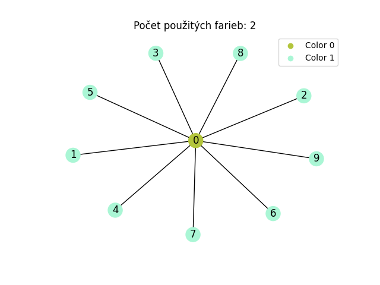
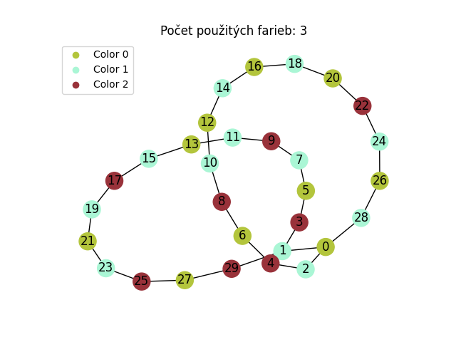
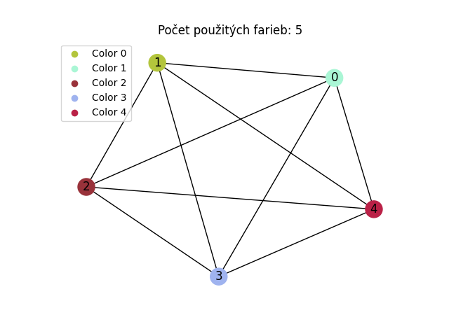
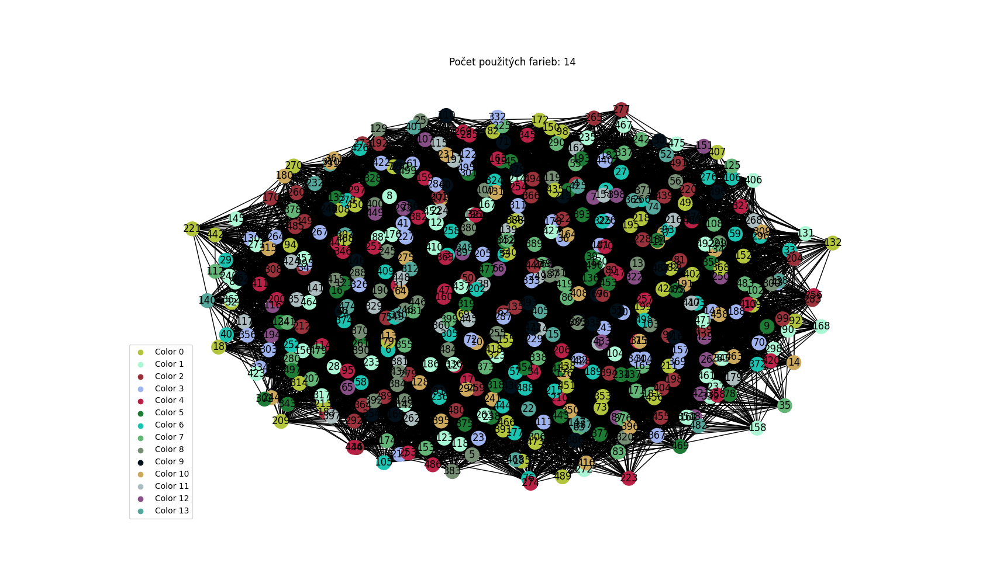
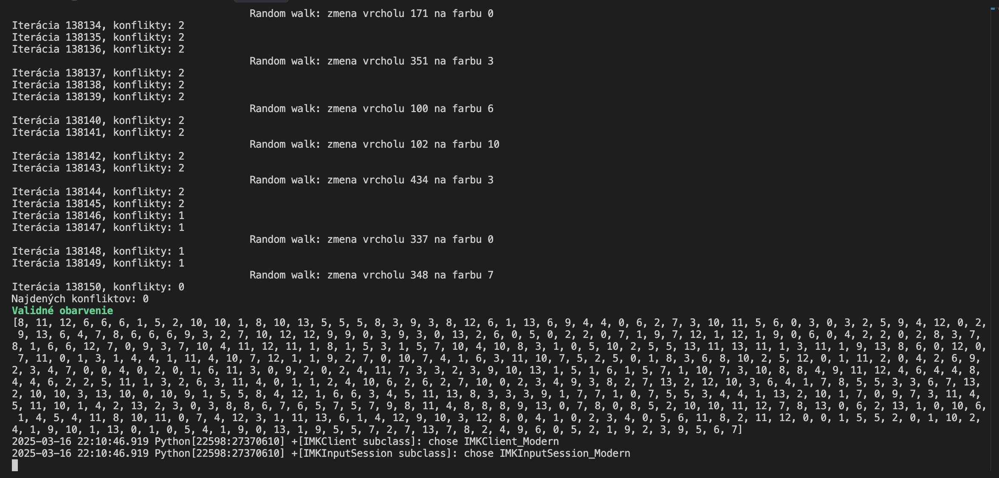

# Farebné obarvenie grafov pomocou lokálneho prehľadávania

Tento projekt demonštruuje, ako riešiť problém farebného obarvenia grafov pomocou lokálneho prehľadávania s využitím techniky "hill climbing" s optimalizáciou random walk. Cieľom je nájsť také obarvenie grafu, v ktorom žiadne dve spojené vrcholy (susediace) nemajú rovnakú farbu.

## Obsah projektu

- **main.py**  
  Hlavný vstupný súbor, ktorý:
  - Umožňuje užívateľovi vybrať graf (na základe preddefinovaných súborov a nastavení farieb).
  - Načíta graf zo súboru vo formáte DIMACS.
  - Spustí algoritmus hill climbing s random walk optimalizáciou.
  - Overí, či je výsledné obarvenie validné.
  - Vykreslí graf a zobrazí počet použitých farieb.

- **hill_climbing.py**  
  Obsahuje implementáciu funkcie `hill_climbing`, ktorá:
  - Inicializuje náhodné obarvenie vrcholov.
  - Pre každý vrchol skúma možnú zmenu farby, ktorá zníži lokálny počet konfliktov.
  - Uprednostňuje farby s menším číslom pri rovnakom zlepšení (t.j. ak je delta rovnaká, vyberie sa farba s nižším indexom).
  - Ak v iterácii nedôjde k žiadnemu zlepšeniu, vykoná sa random walk – náhodná zmena farby pre vybraný vrchol, čo pomáha uniknúť z lokálneho optima.
  - Po každej iterácii sa zistí globálny počet konfliktov a v prípade, že je rovný 0, algoritmus sa ukončí.

- **utils.py**  
  Obsahuje pomocné funkcie:
  - `readdimacs`: Načíta graf zo súboru vo formáte DIMACS.
  - `plot`: Vykreslí graf s obarvením vrcholov a zobrazí počet použitých farieb.
  - `is_coloring`: Overí, či je výsledné obarvenie korektné (t.j. žiadne dve susedné vrcholy nemajú rovnakú farbu).

- **constants.py**  
  Obsahuje konštanty, ktoré definujú:
  - Cesty k jednotlivým grafovým súborom (napr. `PATH0`, `PATH1`, …, `PATH6`).
  - Počet farieb, ktoré môžu byť pre daný graf použité (napr. `NUM_COLORS0`, `NUM_COLORS1`, …).
  - Ďalšie parametre ako `MAX_ITER` a farebné kódy pre výpis (napr. `RED`, `GREEN`, `ORANGE`, `YELLOW`, `RESET`).

## Ako to funguje

1. **Výber grafu:**  
   Funkcia `choose_graph(p)` na základe vstupného čísla (0 až 6) vyberie cestu k príslušnému grafovému súboru a počet farieb, ktoré sa majú použiť.

2. **Načítanie grafu:**  
   Funkcia `readdimacs` zo súboru načíta graf vo formáte DIMACS, kde každý riadok začínajúci písmenom `e` definuje hranu medzi dvoma vrcholmi.

3. **Lokálne prehľadávanie (hill climbing):**  
   - Inicializuje sa náhodné obarvenie všetkých vrcholov
   - Pre každý vrchol sa spočíta lokálny počet konfliktov so susedmi
   - Algoritmus skúma všetky možné zmeny farby pre daný vrchol a vyberá takú zmenu, ktorá najviac zníži počet konfliktov. 
     Pri rovnakom zlepšení je uprednostnená farba s nižším číslom
   - Ak v iterácii nedôjde k žiadnej zmene, vykoná sa random walk – náhodná zmena farby pre jeden vybraný vrchol
   - Po každej iterácii sa spočíta globálny počet konfliktov. Ak je tento počet 0, algoritmus sa ukončí

4. **Overenie a vykreslenie výsledkov:**  
   - Funkcia `is_coloring` overí, či je výsledné obarvenie validné
   - Funkcia `plot` vykreslí graf s použitými farbami a zobrazí aj počet unikátnych farieb

## O inštanciách grafov

### DSJC500.1

Tento projekt používa aj náročné benchmarkové inštancie, ako je **DSJC500.1**, ktorá je popísaná v súbore:

```plaintext
c FILE: DSJC500.1
c
c SOURCE: David Johnson (dsj@research.att.com)
c
c DESCRIPTION: Random graph used in the paper
c              "Optimization by Simulated Annealing: An
c               Experimental Evaluation; Part II, Graph
c               Coloring and Number Partitioning" by
c              David S. Johnson, Cecilia R. Aragon, 
c              Lyle A. McGeoch and Catherine Schevon
c              Operations Research, 39, 378-406 (1991)
c
p edge 500 12458
e 6 2
e 8 3
e 8 4
e 8 7
e 9 4
e 10 2
...
```

## Požiadavky

- **Python 3.x**
- **Knižnice:**  
  - `networkx`
  - `matplotlib`
  - `numpy`

Pre inštaláciu potrebných knižníc môžeš použiť:
```bash
pip install networkx matplotlib numpy
```

## Grafy

### Valid coloring of Star10 - visual


### Valid coloring of graph Cycle30 - visual


### Valid coloring of graph Komplete5 - visual



### Valid coloring of graph 500.1 - visual


### Valid coloring of graph 500.1 - terminal


### Valid coloring of graph 500.1 - matrix
```
[8, 11, 12, 6, 6, 6, 1, 5, 2, 10, 10, 1, 8, 10, 13, 5, 5, 5, 8, 3, 9, 3, 8, 12, 6, 1, 13, 6, 9, 4, 4, 0, 6, 2, 7, 3, 10, 11, 5, 6, 0, 3, 0, 3, 2, 5, 9, 4, 12, 0, 2, 9, 13, 6, 4, 7, 8, 6, 6, 6, 9, 3, 2, 7, 10, 12, 12, 9, 9, 0, 3, 9, 3, 0, 13, 2, 6, 0, 5, 0, 2, 2, 0, 7, 1, 9, 7, 12, 1, 12, 1, 9, 0, 6, 0, 4, 2, 2, 0, 2, 8, 3, 7, 8, 1, 6, 6, 12, 7, 0, 9, 3, 7, 10, 4, 11, 12, 11, 1, 8, 1, 5, 3, 1, 5, 7, 10, 4, 10, 8, 3, 1, 0, 5, 10, 2, 5, 5, 13, 11, 13, 11, 1, 3, 11, 1, 9, 13, 8, 6, 0, 12, 0, 7, 11, 0, 1, 3, 1, 4, 4, 1, 11, 4, 10, 7, 12, 1, 1, 9, 2, 7, 0, 10, 7, 4, 1, 6, 3, 11, 10, 7, 5, 2, 5, 0, 1, 8, 3, 6, 8, 10, 2, 5, 12, 0, 1, 11, 2, 0, 4, 2, 6, 9, 2, 3, 4, 7, 0, 0, 4, 0, 2, 0, 1, 6, 11, 3, 0, 9, 2, 0, 2, 4, 11, 7, 3, 3, 2, 3, 9, 10, 13, 1, 5, 1, 6, 1, 5, 7, 1, 10, 7, 3, 10, 8, 8, 4, 9, 11, 12, 4, 6, 4, 4, 8, 4, 4, 6, 2, 2, 5, 11, 1, 3, 2, 6, 3, 11, 4, 0, 1, 1, 2, 4, 10, 6, 2, 6, 2, 7, 10, 0, 2, 3, 4, 9, 3, 8, 2, 7, 13, 2, 12, 10, 3, 6, 4, 1, 7, 8, 5, 5, 3, 3, 6, 7, 13, 2, 10, 10, 3, 13, 10, 0, 10, 9, 1, 5, 5, 8, 4, 12, 1, 6, 6, 3, 4, 5, 11, 13, 8, 3, 3, 3, 9, 1, 7, 7, 1, 0, 7, 5, 5, 3, 4, 4, 1, 13, 2, 10, 1, 7, 0, 9, 7, 3, 11, 4, 5, 11, 10, 1, 4, 2, 13, 2, 3, 0, 3, 8, 8, 6, 7, 6, 5, 7, 5, 7, 9, 8, 11, 4, 8, 8, 8, 9, 13, 0, 7, 8, 0, 8, 5, 2, 10, 10, 11, 12, 7, 8, 13, 0, 6, 2, 13, 1, 0, 10, 6, 1, 4, 5, 4, 11, 8, 10, 11, 0, 7, 4, 12, 3, 1, 11, 13, 6, 1, 4, 12, 9, 10, 3, 12, 8, 0, 4, 1, 0, 2, 3, 4, 0, 5, 6, 11, 8, 2, 11, 12, 0, 0, 1, 5, 5, 2, 0, 1, 10, 2, 4, 1, 9, 10, 1, 13, 0, 1, 0, 5, 4, 1, 9, 0, 13, 1, 9, 5, 5, 7, 2, 7, 13, 7, 8, 2, 4, 9, 6, 0, 5, 2, 1, 9, 2, 3, 9, 5, 6, 7]
```

Inšpirácia pre grafy na lokálne prehladávanie
https://cedric.cnam.fr/~porumbed/graphs/