# Umelá evolúcia a evolučné algoritmy

Táto prednáška predstavuje základné princípy umelej evolúcie a evolučných algoritmov, ktoré využívajú inšpiráciu z prírodného evolučného procesu (napr. Darwinovej teórie) na riešenie zložitých optimalizačných úloh. Evolučné algoritmy sú mimoriadne užitočné, najmä keď nevieme presne, ako má ideálne riešenie vyzerať, ale poznáme požadované vlastnosti.

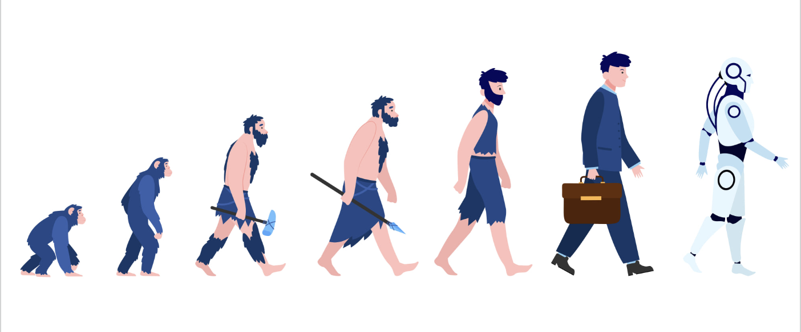

## Základné princípy umelej evolúcie

- **Inšpirácia z biológie:**  
  Evolučné algoritmy čerpajú zo základných princípov prírodnej evolúcie: 
  - **Dedičnosť:** Jedinci môžu zdediť vlastnosti od svojich rodičov.
  - **Variabilita:** V populácii existujú rozdiely, ktoré umožňujú vznik nových riešení.
  - **Prírodný výber:** Jedinci s lepšími vlastnosťami majú väčšiu šancu prežiť, rozmnožiť sa a odovzdať svoje vlastnosti ďalej.

- **Náhodná inicializácia:**  
  Na začiatku generujeme populáciu jedincov (riešení) náhodne, čo znamená, že prvotné riešenia môžu byť neplatné alebo nekvalitné, ale obsahujú základnú genetickú informáciu.

### Evolučný algoritmus koncept
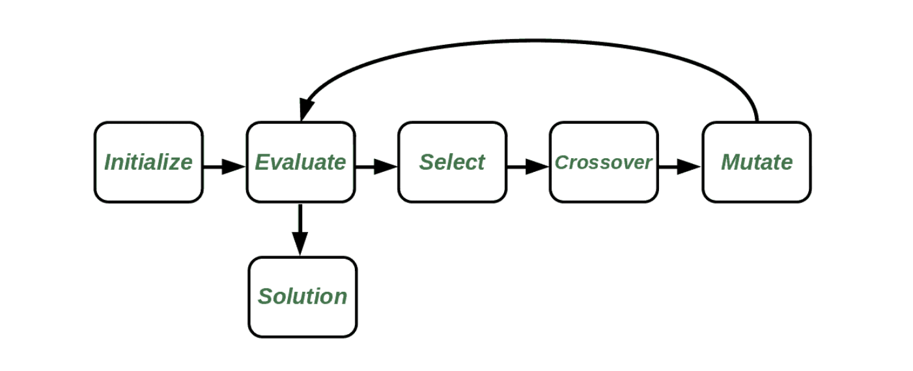

## Evolučný proces a kľúčové komponenty

Evolučné algoritmy pracujú na základe opakovaných generácií, kde sa populácia jedincov postupne zlepšuje. Hlavné kroky sú:

### 1. Kódovanie jedincov 

Každý jedinec predstavuje riešenie úlohy a môže byť zakódovaný rôznymi spôsobmi:
- **Binárne kódovanie:**  
  Jedinec je reťazec 0 a 1, čo je pôvodný spôsob, ktorý používal Holland.

  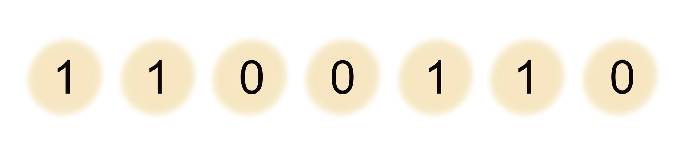

- **Stromové kódovanie:**  
  Používa sa pre zložitejšie štruktúry (napr. rozhodovacie stromy, programy).

  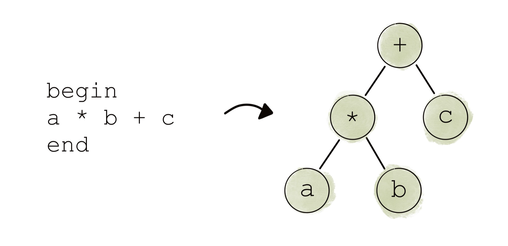

- **N-tice alebo tabuľkové kódovanie:**  
  Vhodné pre reprezentáciu posloupností alebo akčných plánov.
  
  

### 2. Fitness funkcia

Fitness funkcia hodnotí, ako dobré je riešenie reprezentované jedincami. Príklady:
- **Optimalizácia funkcie:** Fitness je hodnota funkcie v danom bode.
- **Hľadanie stratégie:** Fitness môžeme získať opakovaným pustením tejto stratégie proti súperom a vyčísliť ako počet výhier.
- **SAT problém:** Fitness je počet splnených klauzúl.
- **Optimalizácia dizajnu:** Napríklad optimalizácia tvaru krídla, kde fitness vychádza z fyzikálnych simulácií.
- **Hľadanie maxima funkcie f(x)** – Jedinec reprezentuje bod x v priestore, jeho fitness môže byť funkčná hodnota v danom bode x.

#### Maximalizačná fitness funkcia
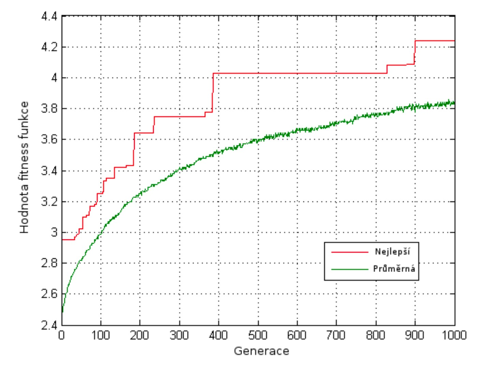

#### Minimalizačná fitness funkcia
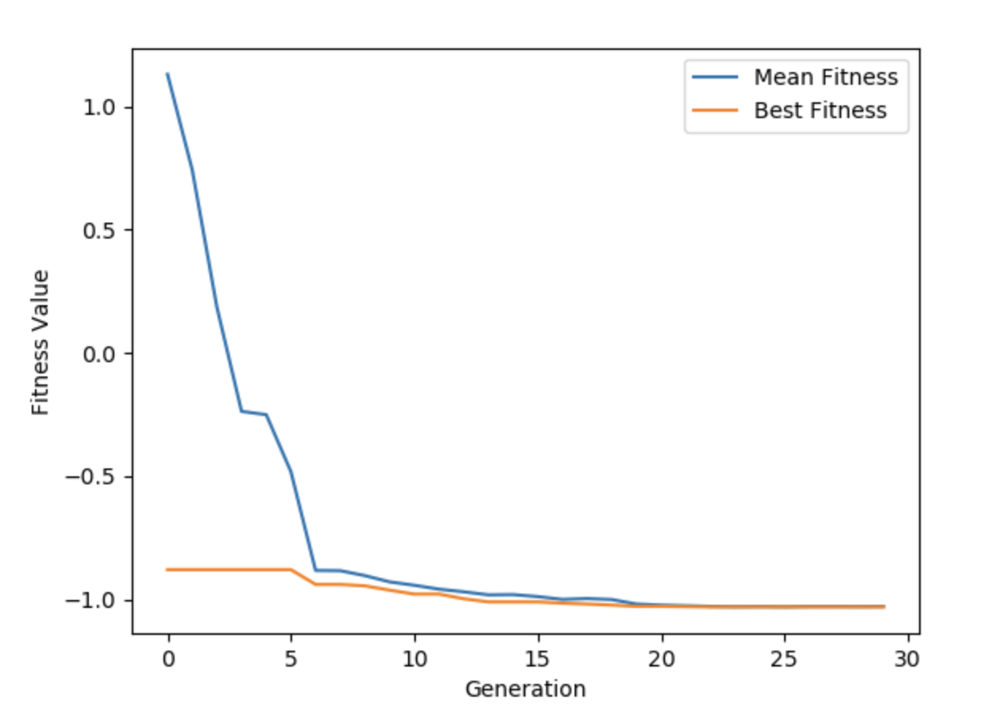

### 3. Selekcia

V evolučných algoritmoch zohráva selekcia kľúčovú úlohu – na základe fitness (hodnotenia kvality) sa z aktuálnej generácie vyberajú jedinci, ktorí budú "rodičmi" novej generácie. Cieľom je zachytiť a preniesť do ďalšej generácie tie genetické informácie, ktoré prispievajú k lepšiemu riešeniu problému, pričom zároveň nechceme, aby sa populácia príliš homogenizovala a uviazla v lokálnom optime. Preto musíme nájsť správny kompromis medzi preferovaním silných jedincov a zachovaním diverzity, ktorá môže obsahovať aj jedincov s nižšou fitness, ale potenciálne užitočnými vlastnosťami.

Medzi bežne používané metódy selekcie patria:

- **Ruletová selekcia:**  
  Každému jedincovi sa na základe jeho fitness priradí úsek na ruletovom kolese – čím je fitness jedinca vyššia, tým väčší úsek má. Pri výbere nových jedincov "točíme ruletou" (v praxi sa generuje náhodné číslo z intervalu [0, 1] a porovnáva sa s kumulatívnym rozdelením fitness), pričom pravdepodobnosť výberu je úmerná fitness.  
  - **Výhody:** Jednoduchá implementácia, pri dostatočne veľkej populácii poskytuje vyvážené zastúpenie jedincov.  
  - **Nevýhody:** Pri veľkých rozdieloch vo fitness môže dochádzať k nadmernému preferovaniu najsilnejších jedincov, čo znižuje diverzitu populácie a môže viesť k uviaznutiu v lokálnom optime.
  
  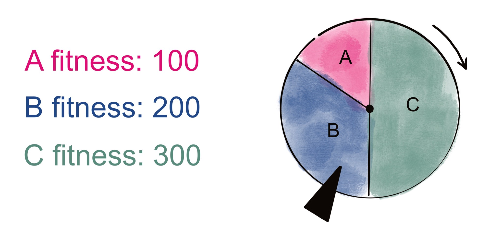

- **Stochastic Universal Sampling (SUS):**  
  Ide o vylepšenú verziu ruletovej selekcie. Namiesto opakovaného točenia ruletou sa vygeneruje jedno náhodné číslo a potom sa rozdelí interval [0, 1] rovnomerne na N častí (kde N je počet vybraných jedincov). Každý "jazýček" (pointer) potom vyberie jedinca podľa svojej pozície v tomto intervale.  
  - **Výhody:** SUS zabezpečuje rovnomerné pokrytie celého intervalu, čím znižuje variabilitu výsledkov selekcie a zachováva diverzitu v populácii.  
  - **Nevýhody:** Metóda je o niečo zložitejšia na implementáciu, ale poskytuje stabilnejší výber.
  
  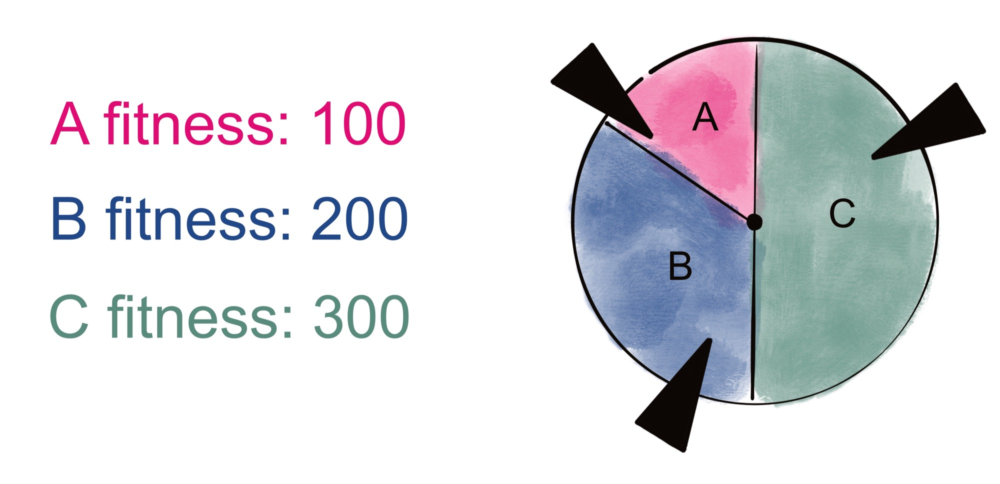

- **Elitizmus:**  
  Pri elitizme sa najlepší jedinci z aktuálnej generácie automaticky prenášajú do novej generácie. Tým sa zaručuje, že tie najlepšie riešenia, ktoré už boli v populácii nájdené, sa nestratia.  
  - **Výhody:** Elitizmus významne zlepšuje výkon evolučných algoritmov, pretože zabezpečuje, že najlepšie riešenia zostanú zachované a môžu slúžiť ako základ pre ďalší vývoj.  
  - **Nevýhody:** Ak sa aplikuje príliš prísne, môže viesť k zníženiu diverzity, pretože stále silní jedinci dominujú celej populácii.

- **Turnajová selekcia:**  
  Pri tejto metóde sa náhodne vyberie skupina jedincov (napr. dvojica) a medzi nimi sa vyberie silnejší jedinec s určitou pravdepodobnosťou (napr. 75 %). Zvyšok, s pravdepodobnosťou 25 %, môže vyhrať aj slabší jedinec, čo dáva šancu na zachovanie diverzity.  
  - **Výhody:** Je veľmi jednoduchá na implementáciu, umožňuje presnú kontrolu nad pravdepodobnosťou výberu silnejších jedincov a súčasne zachováva diverzitu v populácii.  
  - **Nevýhody:** Výsledok môže byť závislý na náhodnom výbere skupín, a preto sa môže vyskytnúť, že silný jedinec nebude vybraný, ale táto pravdepodobnosť je zvyčajne veľmi nízka.

- **Boltzmannova selekcia:**  
  Táto metóda je inšpirovaná simulovaným žíhaním. Na začiatku, keď je "teplota" vysoká, sa do selekcie zahrnujú aj jedinci s nižšou fitness, čo pomáha udržiavať variabilitu. S časom, ako teplota klesá, sa preferujú jedinci so silnejšou fitness.  
  - **Výhody:** Umožňuje dynamicky meniť selekčné tlaky, čo môže pomôcť pri prekonávaní lokálnych optim a zachovaní diverzity na začiatku evolučného procesu.  
  - **Nevýhody:** Vyžaduje starostlivé nastavenie teplotného harmonogramu a môže byť zložitejšie na implementáciu.

### 4. Genetické operátory

Pre vytvorenie novej generácie sa využívajú genetické operátory:
- **Crossover:**  
  Kombinácia genetickej informácie dvoch rodičov, ktorá môže prebiehať jednobodovo, dvojbodovo alebo viacbodovo.
  
  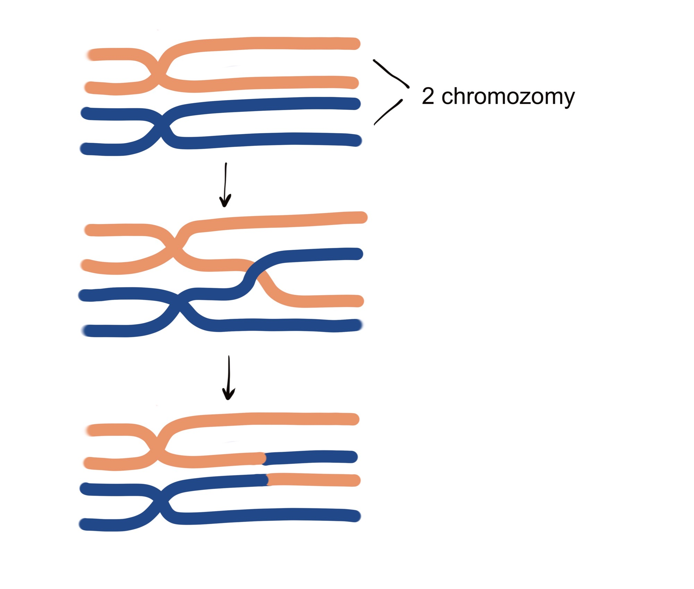

  #### Jednobodový crossover
  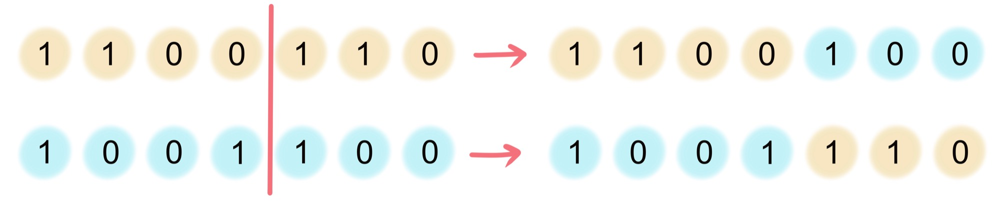

  #### Dvojbodový crossover
  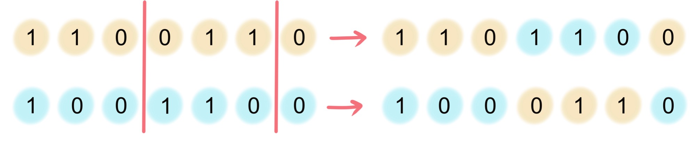

  #### Viacbodový crossover
  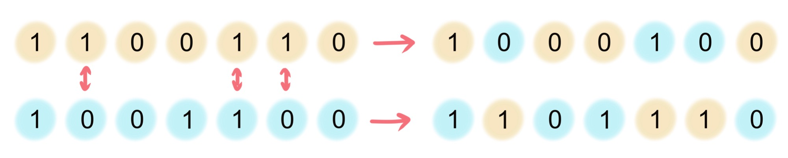

- **Mutácia:**  
  Náhodná zmena v jedincovi, ktorá prináša novú genetickú informáciu a pomáha pri preskúmavaní vyhľadávacieho priestoru.
  
  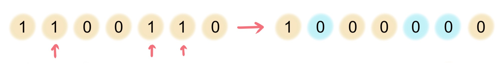

### 5. Evolučný cyklus

Celý evolučný algoritmus prebieha v nasledujúcich fázach:
- **Inicializácia:**  
  Generácia populácie jedincov (náhodné riešenia).
- **Hodnotenie:**  
  Každý jedinec je ohodnotený fitness funkciou.
- **Selektívna reprodukcia a genetické operátory:**  
  Na základe fitness sa vytvára nová generácia.
- **Opakovanie:**  
  Tento proces sa opakuje, kým sa nedosiahne uspokojivé riešenie alebo preddefinovaný počet generácií.

#### Evolučný algoritmus cyklus
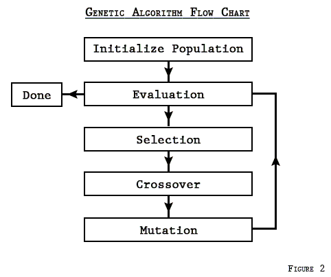

#### Evolučný algoritmus schéma
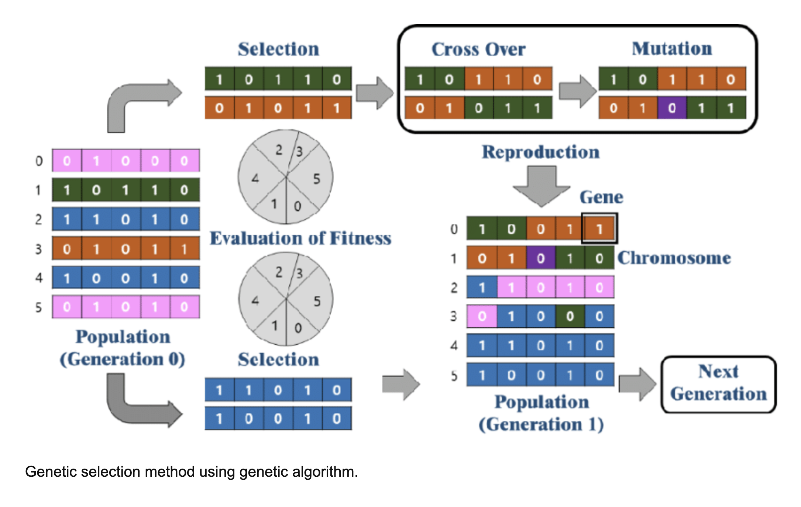

## Hollandove genetické algoritmy

John Holland predstavil svoje genetické algoritmy v knihe *Adaptation in Natural and Artificial Systems* (1975). Jeho prístup sa stal základom pre evolučné algoritmy, pričom poskytuje univerzálny rámec:
- **Definovať kódovanie jedincov**
- **Nastaviť mechanizmus selekcie**
- **Navrhnúť genetické operátory (crossover, mutácia)**
- **Stanoviť fitness funkciu**

Tento rámec môže byť aplikovaný na riešenie rôznych problémov, od grafového obarvenia po optimalizáciu dizajnu či evolučné programovanie.

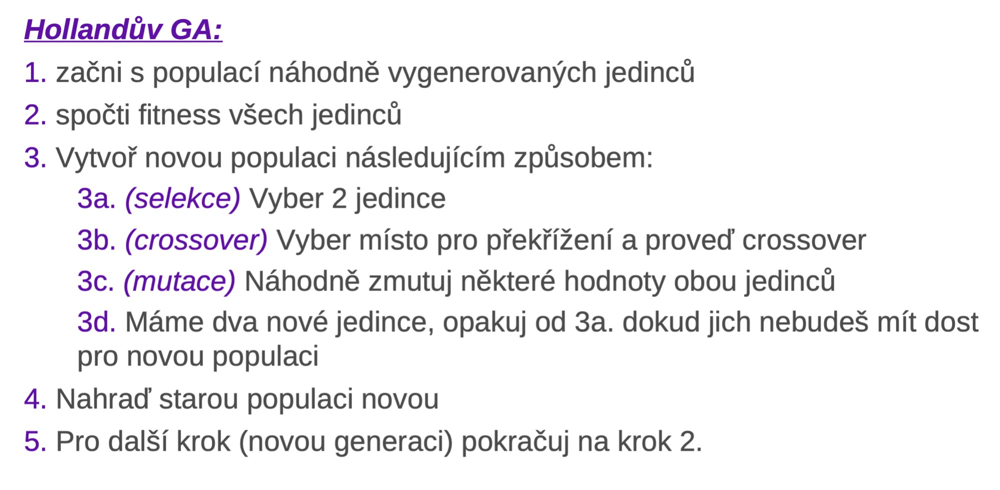

## Aplikácie evolučných algoritmov

### Výhody evolučných algoritmov

- **Jednoduchosť implementácie:**  
  Evolučné algoritmy sú relatívne jednoduché na implementáciu a prispôsobenie konkrétnym problémom.
  
- **Jednoduchá paralelizácia:**  
  Práca s populáciou jedincov umožňuje jednoduchú paralelizáciu, pretože hodnotenie fitness jednotlivých jedincov môže prebiehať nezávisle.

- **Schopnosť riešiť náročné úlohy:**  
  Dokážu vyriešiť aj veľmi zložité a nelineárne problémy, kde tradičné metódy často zlyhávajú.

- **Použitie, keď nepoznáme presnú podobu riešenia:**  
  Evolučné algoritmy sa osvedčili v prípadoch, keď presná štruktúra ideálneho riešenia nie je známa, ale vieme, aké vlastnosti by malo riešenie mať.

## Nevýhody evolučných algoritmov

- **Absencia záruky globálneho optima:**  
  Evolučné algoritmy nemusia vždy nájsť globálne optimálne riešenie, pretože sa môžu zaseknúť v lokálnom optimum.

- **Pomalá konvergencia:**  
  Konvergencia k optimálnemu riešeniu môže byť veľmi pomalá, najmä ak je fitness krajina výrazne zvlnená.

- **Náročnosť na ladenie parametrov:**  
  Úspech algoritmu silno závisí od správneho nastavenia parametrov (veľkosť populácie, miera mutácie, selekčné metódy a pod.), čo môže vyžadovať rozsiahle experimenty a skúšky.

- **Možné problémy so zachovaním diverzity:**  
  Ak sú silnejší jedinci uprednostňovaní príliš silno, populácia môže stratiť diverzitu a evolúcia môže uviaznuť v lokálnom optime.

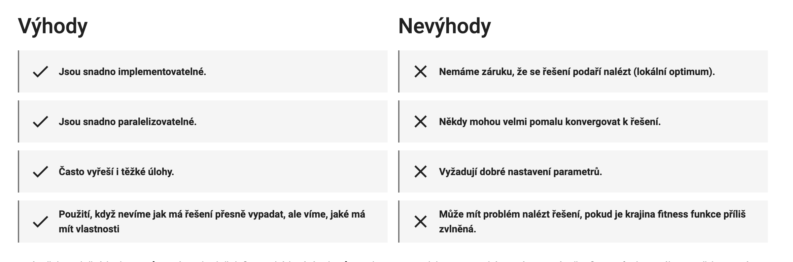

## Evolučné algoritmy našli svoje uplatnenie v mnohých oblastiach:
- **Optimalizácia dizajnu:**  
  Napríklad u Boeingu 777, kde evolučná optimalizácia lopatiek motorov viedla k významnej úspore paliva.
- **Návrh antén:**  
  NASA použila evolučné algoritmy na návrh antény s netradičným tvarom, ktorý by ľudský dizajnér ťažko navrhol.
- **Forenzná identifikácia:**  
  Evolučné algoritmy môžu pomôcť zostaviť identiku pachateľa zo sádia jednotlivých častí tváre.
- **Generatívne umenie:**  
  Evolučné metódy sa používajú na tvorbu umeleckých diel, kde sa umelecké riešenia evolvujú a hodnotia.
- **Hľadanie architektúry neurónových sietí:**  
  Automatické vyhľadávanie optimálnej štruktúry neurónových sietí využíva evolučné algoritmy.

## Záver

Evolučné algoritmy poskytujú flexibilný a univerzálny rámec pre riešenie optimalizačných úloh, najmä keď presná podoba riešenia nie je vopred známa. Vďaka princípom evolúcie, ako je selekcia, crossover a mutácia, dokážu tieto algoritmy postupne zlepšovať populáciu riešení a hľadať optimálne alebo aspoň veľmi kvalitné riešenia aj pre náročné problémy. Úspech evolučných algoritmov závisí na správnom nastavení parametrov, voľbe vhodného kódovania jedincov a definovaní efektívnej fitness funkcie.

Experimentujte s rôznymi evolučnými stratégiami a aplikujte ich na riešenie konkrétnych problémov – od grafového obarvenia až po komplexné inžinierske optimalizácie. Evolučné algoritmy dokazujú svoju univerzálnosť a efektívnosť v mnohých reálnych aplikáciách, čo ich robí dôležitým nástrojom aj v modernej umelej inteligencii.
