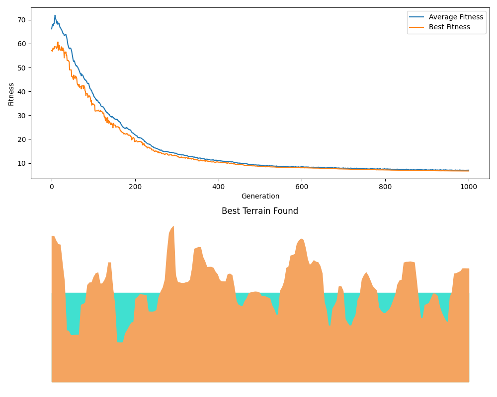
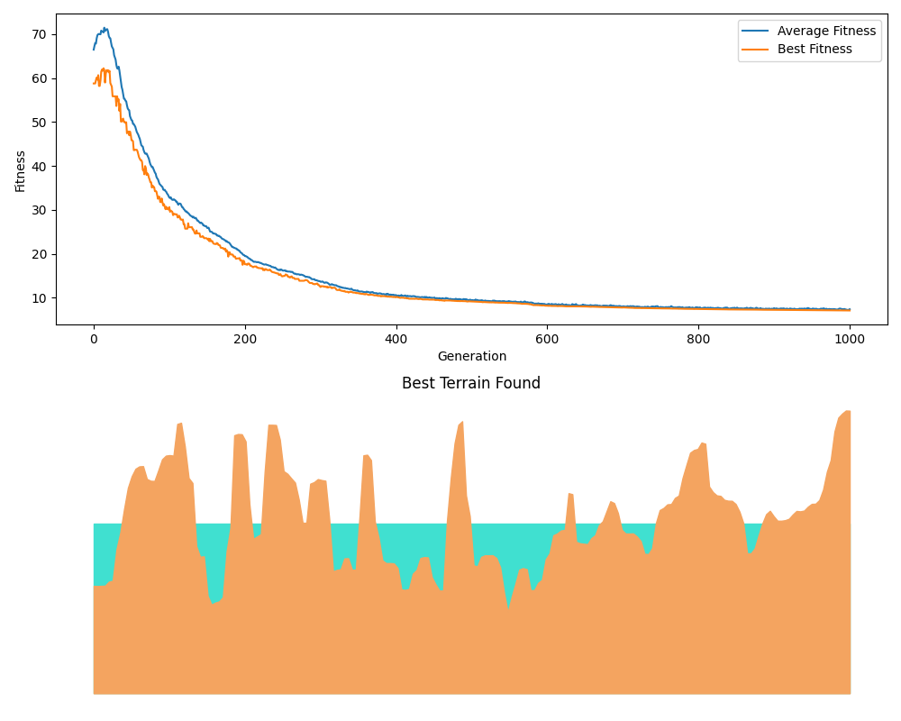
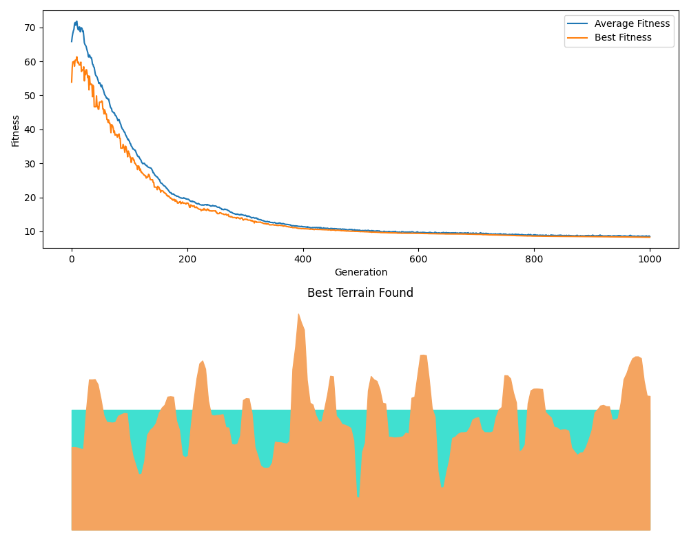

# Evolučné generovanie terénu pomocou DEAP

Tento projekt využíva knižnicu `DEAP` (Distributed Evolutionary Algorithms in Python) na evolučné generovanie terénovej funkcie. Cieľom projektu je vytvoriť jedinca – reprezentovaného zoznamom hodnôt, ktoré symbolizujú výšky terénu – a optimalizovať ho pomocou evolučného algoritmu, tak aby výsledný terén spĺňal požadované kritériá.

---

## Obsah projektu

- **main.py**  
  Hlavný spúšťací skript. Na začiatku inicializuje toolbox, spustí evolučný algoritmus a nakoniec zobrazí výsledky evolúcie a najlepší nájdený terén.

- **constants.py**  
  Obsahuje konštanty, ktoré definujú parametre evolúcie:
  - `TERRAIN_LENGTH`: Dĺžka generovaného terénu (počet bodov)
  - `SEA_LEVEL`: Hladina mora (hranica, nad ktorou sa považujú body za pevninu)
  - `POP_SIZE`: Veľkosť populácie
  - `NGEN`: Počet generácií
  - `CXPB`: Pravdepodobnosť kríženia (crossover)
  - `MUTPB`: Pravdepodobnosť mutácie (mutation)

- **utils.py**  
  Obsahuje pomocnú funkciu `plot_results`, ktorá vykresľuje priebeh evolúcie (graf fitness) a vizualizáciu najlepšieho terénu.

- **teren.py**  
  Hlavný modul, ktorý:
  - Definuje fitness funkciu, ktorá hodnotí jedinca podľa hladkosti terénu a pomeru bodov nad hladinou mora
  - Inicializuje DEAP toolbox so zaregistrovanými genetickými operátormi (kríženie, mutácia, selekcia)
  - Obsahuje funkcie `evolve_terrain` na spustenie evolučného algoritmu a `init_toolbox` na nastavenie evolučného prostredia

---

## Ako to funguje

1. **Fitness funkcia**  
   Funkcia `evaluate(individual)` hodnotí jedinca (terén) nasledovne:
   - **Hladkosť terénu:**  
     Počíta absolútne rozdiely medzi susednými bodmi. Menšie rozdiely znamenajú hladší terén
   - **Pomer pevniny:**  
     Vypočíta sa pomer bodov, ktoré sú nad hladinou mora (`SEA_LEVEL`) - ak tento pomer nie je približne 60 % (0.6), aplikuje sa penalizácia
   - Celková fitness je súčet hladkosti a penalizácie
   - Cieľom evolúcie je minimalizovať fitness (nižšia hodnota znamená lepšie riešenie)

2. **Inicializácia evolučného prostredia**  
   V module `teren.py` sa pomocou DEAP dynamicky vytvoria triedy:
   - `FitnessTerrain`: Trieda fitness, kde chceme minimalizovať fitness (váha je nastavená na -1.0).
   - `Individual`: Trieda jedinca, ktorý je zoznamom hodnôt a má atribút `fitness` typu `FitnessTerrain`.
   
   Toolbox sa následne zaregistruje s funkciami:
   - **Generovanie atribútov:** `attr_float` vytvára náhodné čísla medzi 0 a 1
   - **Generovanie jedincov a populácie:** Každý jedinec je zoznam dĺžky `TERRAIN_LENGTH`, a populácia je zoznam jedincov
   - **Genetické operátory:**  
     - `mate`: Blend crossover (`cxBlend`) s parametrom `alpha=0.5` pre kombináciu rodičovských hodnôt
     - `mutate`: Gaussova mutácia (`mutGaussian`) s parametrom `sigma=0.1` a pravdepodobnosťou mutácie `indpb=0.1`
     - `select`: Turnajová selekcia (`selTournament`) s veľkosťou turnaja 2

3. **Evolučný cyklus**  
   Funkcia `evolve_terrain(toolbox)`:
   - Inicializuje populáciu veľkosti `POP_SIZE`
   - Nastaví štatistiky evolúcie (priemerná, najlepšia a najhoršia fitness) a vytvorí Hall of Fame pre uchovávanie najlepšieho jedinca
   - Spustí evolučný algoritmus pomocou funkcie `eaSimple`, ktorá vykonáva kríženie, mutáciu a selekciu cez `NGEN` generácií
   - Po ukončení evolúcie vráti finálnu populáciu, logbook so štatistikami a najlepší jedinec z Hall of Fame

4. **Vizualizácia výsledkov**  
   Funkcia `plot_results` (v module `utils.py`) vykreslí:
   - Graf s vývojom fitness (priemerná a najlepšia hodnota) v jednotlivých generáciách
   - Vizualizáciu najlepšieho terénu – zobrazenie terénu v 2D, kde sa ukáže, ako sa výšky bodov menia a kde sa nachádza hladina mora

---

## Vygenerovaný terén pomocou knižnice DEAP

### Terén 1

### Terén 2

### Terén 3

