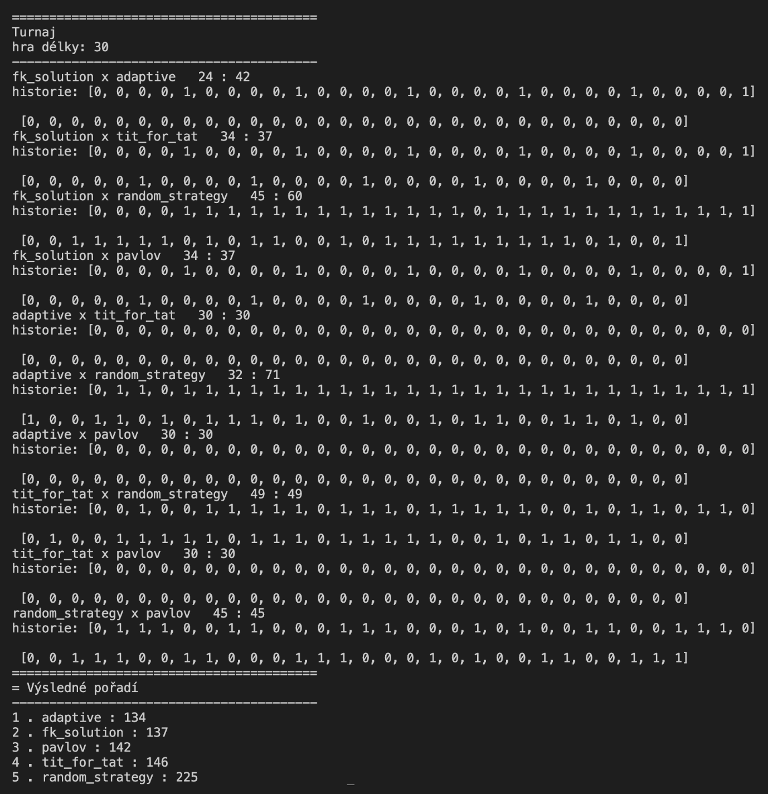

# Prisoners Tournament

Tento projekt simuluje turnaj vo väzňovom dileme medzi viacerými stratégiami. Cieľom je porovnať rôzne prístupy ku kooperácii a zrade v opakovanej hre pomocou bodovania. Medzi hráčmi je aj evolučná stratégia využívajúca genetické algoritmy.

---

## O hre – Väzňovo dilema

Každý hráč si môže v každom kole vybrať medzi:
- **spoluprácou (0)** alebo
- **zradou (1)**

Výsledky podľa kombinácie ťahov:

| Hráč A | Hráč B | Body A | Body B |
|--------|--------|--------|--------|
| 0      | 0      | 1      | 1      |
| 0      | 1      | 3      | 0      |
| 1      | 0      | 0      | 3      |
| 1      | 1      | 2      | 2      |

---

## `fk_solution` – 🧬 Evolučná stratégia

`fk_solution` je inteligentná stratégia, ktorá si počas hry vyvíja svoje rozhodovanie pomocou **genetického algoritmu**. Neobsahuje žiadne natvrdo zakódované správanie (okrem jedného taktického pravidla), ale adaptuje sa podľa správania súpera.

### Čo si vyvíja?
Každá stratégia (jedinec) má tri parametre:

1. `threshold` – hranica, pri ktorej už stratégia zradí
2. `lookback` – ako ďaleko späť do histórie sa pozerá
3. `forgiveness` – ako veľmi odpúšťa zrady

### Ako to funguje?
1. **Spočítame mieru zrady** súpera za posledných X ťahov.
2. **Zrátame odpustenie**, teda mieru zrady znížime podľa `forgiveness`.
3. Ak je výsledná hodnota väčšia ako `threshold`, zradíme. Inak spolupracujeme.

### Genetický algoritmus
Používa sa knižnica `DEAP`. V každom kole:

- **vygeneruje sa populácia** náhodných stratégií (parametre sú floaty v rozsahu 0–1)
- každá stratégia sa **vyhodnotí** – snaží sa predpovedať ťahy súpera
- prebieha **kríženie, mutácia a selekcia** počas niekoľkých generácií
- najlepšia stratégia sa použije na rozhodnutie v aktuálnom kole

### Špeciálne pravidlo
Každé piate kolo (`BETRAY_ROUND = 5`) stratégia automaticky zradí, aby otestovala reakciu súpera.

---

## Ostatné stratégie

- `adaptive` – sleduje mieru spolupráce súpera a podľa toho sa rozhoduje
- `tit_for_tat` – opakuje posledný ťah súpera
- `pavlov` – ak sa posledné ťahy oboch zhodujú, zopakuje ho, inak zmení
- `random_strategy` – náhodný výber medzi zradou a spoluprácou

---

## Priebeh turnaja

Turnaj je implementovaný ako každý s každým. Výsledky sa vypíšu po skončení:
Občas moja stratégia vyhrá, občas nie

