# Neurónové siete

Tento dokument poskytuje prehľad základných konceptov umelej neurónovej siete, od modelu jednotlivého neurónu až po moderné architektúry ako CNN a RNN.

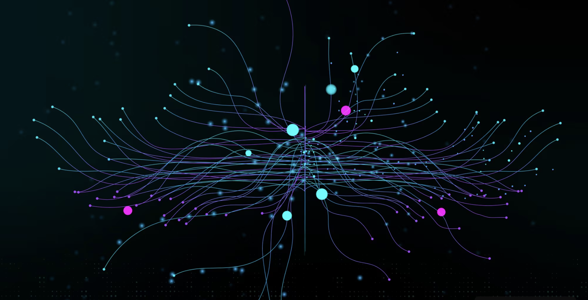 

## Model umelého neurónu (Perceptron)
- **Biologický paralel:** Neurón má dendrity (vstupy) a axón (výstup). Signály sa sčítavajú a ak prekročia prah, neurón „odpáli“ signál.

- **Perceptron (1958):**  
  - Vstupy: \(x_1, x_2, ..., x_n\)  
  - Váhy: \(w_1, w_2, ..., w_n\)  
  - Práh: \(Θ -> théta)  
  - Výstup \(y\):
    ```math
    y =
      \begin{cases}
        1, & \text{ak } \sum_i w_i x_i \ge \theta,\\
        0, & \text{inak.}
      \end{cases}
    ```

  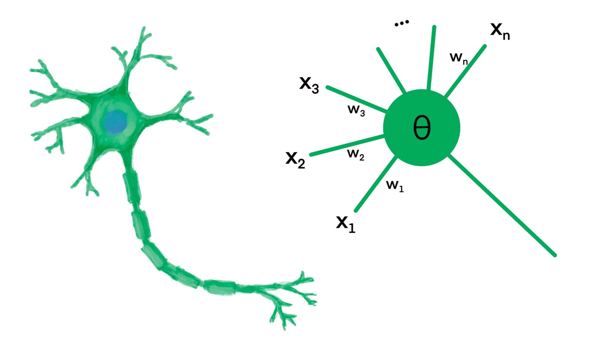

- **Lineárna separabilita:** Perceptron rozdeľuje priestor nadrovinou. Rozlíši len lineárne separabilné problémy (napr. AND, OR), no nie XOR ani NXOR.

  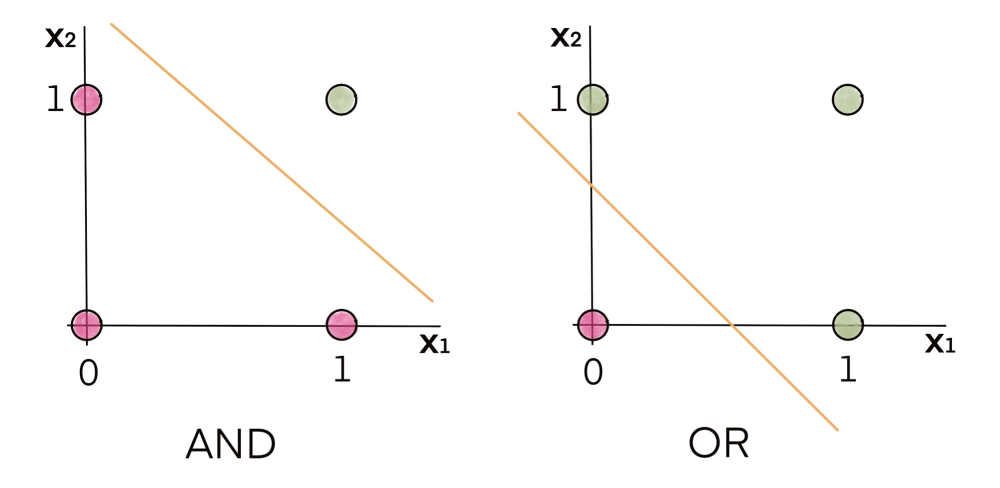 
  
  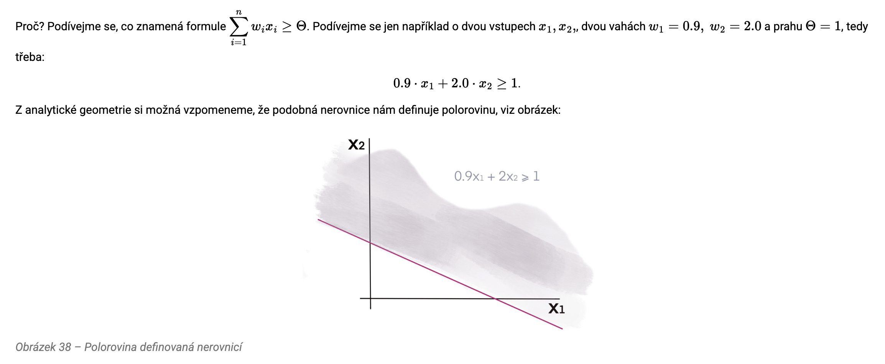 

- **Tabulka všetkých možných 16 logických funkcí o dvou vstupech** 
  
  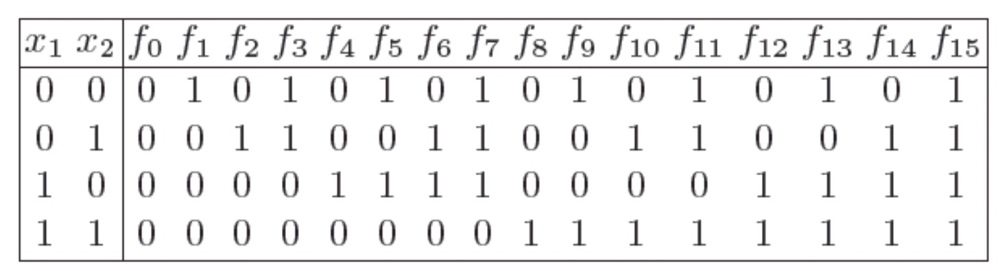  

## Dopredná neurónová sieť (Feedforward)
- Vrstvy neurónov bez spätných cyklov:
  1. **Vstupná vrstva** (I)  
  2. **Skryté vrstvy** (N)  
  3. **Výstupná vrstva** (O)  
- Signál prechádza len jedným smerom (bez cyklov). 
  
  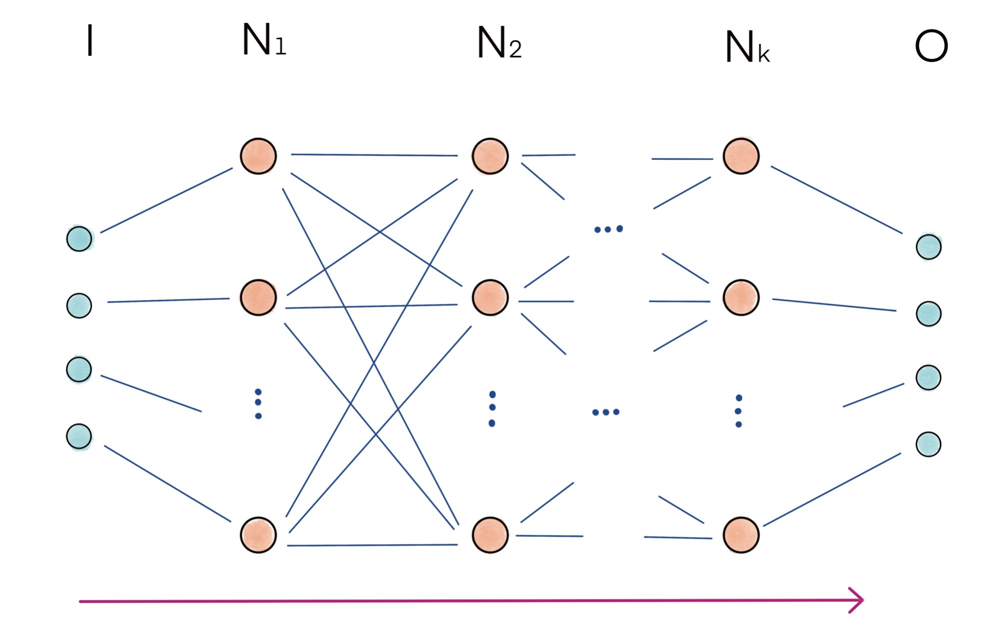 
  
- **Príklad XOR:** Potrebujeme dva perceptrony v prvej vrstve + jeden OR-perceptron v druhej vrstve, aby sieť dokázala reprezentovať XOR.
  
  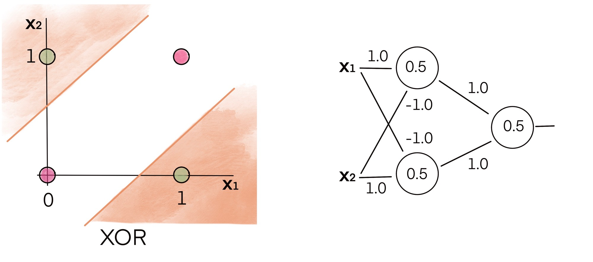 

- **V priestore n:** budeme k separácii potrebovať n+1 neurónov pre vymedzenie množiny bodov a jeden AND neuron, ktorý nám povie či všetky body z množiny splňujú polohu polrovin.

	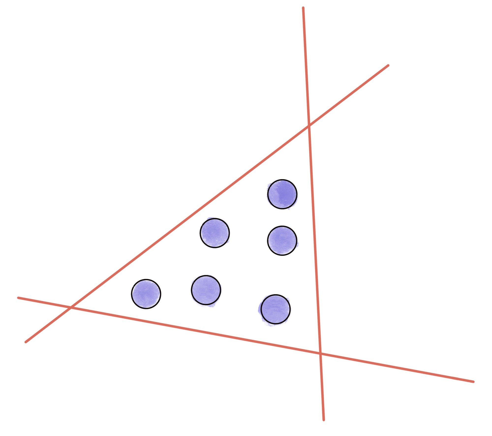  

## Aktivačné funkcie
- **Skoková (Heaviside):**  
	Jednoduchá, ale nediferencovateľná v prahu.
	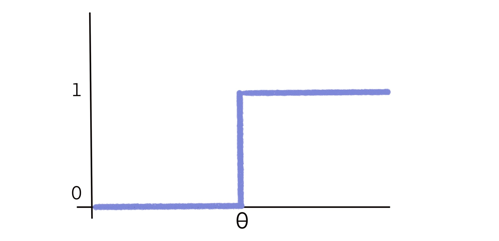  

- **Lineárna:**  
	Priame prevedenie signálu. 
	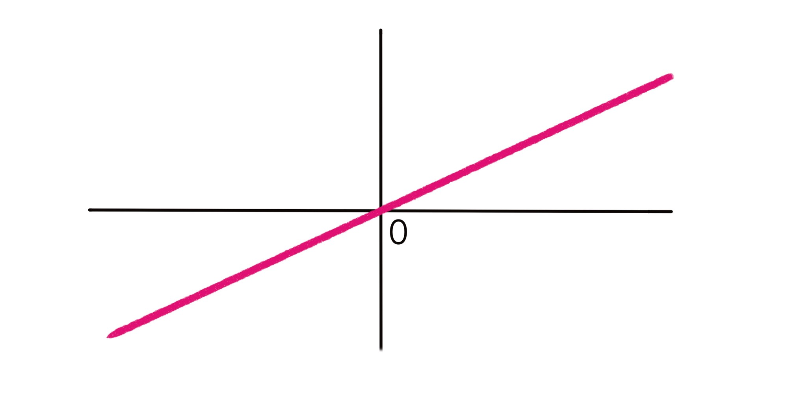 
- **ReLU:**  
	Rýchla konvergencia, rieši negatívne hodnoty. 
	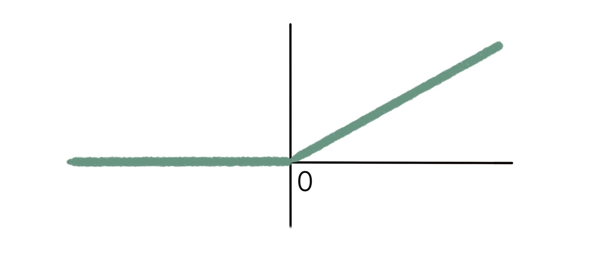 
- **Sigmoida (logistická):**  
	Výstup v (0,1), hladká.  
	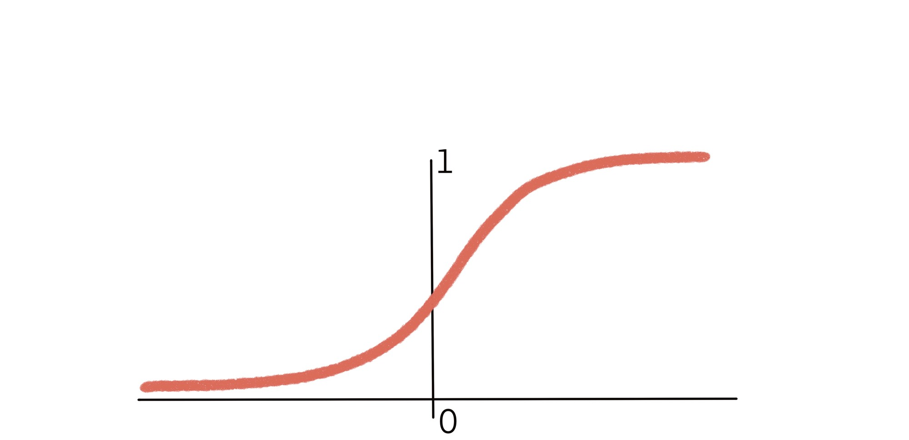
- **Tanh (hyperbolický):**  
	Výstup v (−1,1), centrálny okolo 0.
	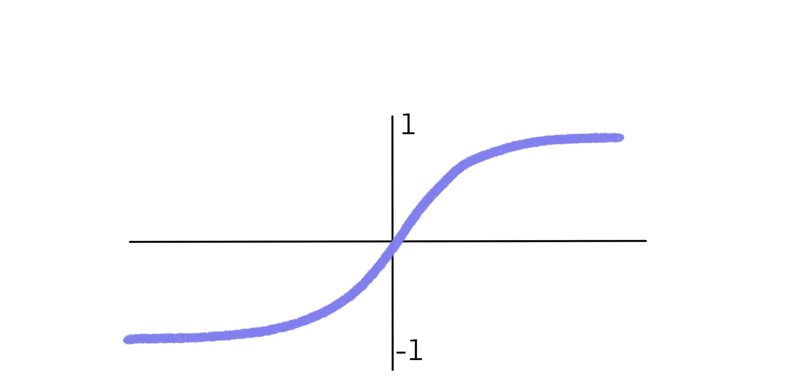

## Neurónová sieť ako funkcia
- Sieť predstavuje zloženú funkciu \(f:\mathbb{R}^n\to\mathbb{R}^m\).  
- Rieši úlohy ako klasifikácia, predikcia či riadenie.  
- Problém učenia: správne nastaviť váhy a prahy, aby sieť vracala očakávané výstupy.

## Typy neurónových sietí

### 1. Dopredné siete (Feed forward Neural Networks)
- Vrstvy: vstupná → skryté → výstupné.  
- Žiadne cykly, signál prudí iba jedným smerom.

	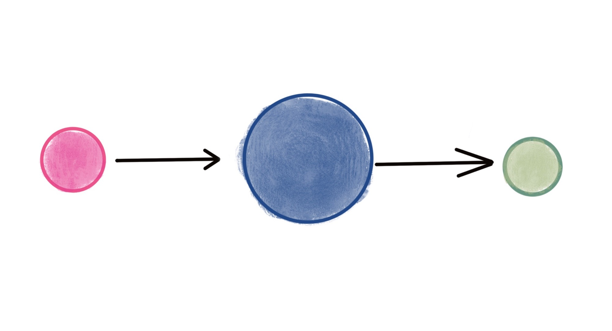

### 2. Hlboké siete (DNN - Deep Neural Networks)
- Viacero skrytých vrstiev (dve a viac).  
- Automatická extrakcia vlastností (feature learning). 
- Problémy: vanishing gradient — riešenie: dropout, batch norm, reziduálne vrstvy.

	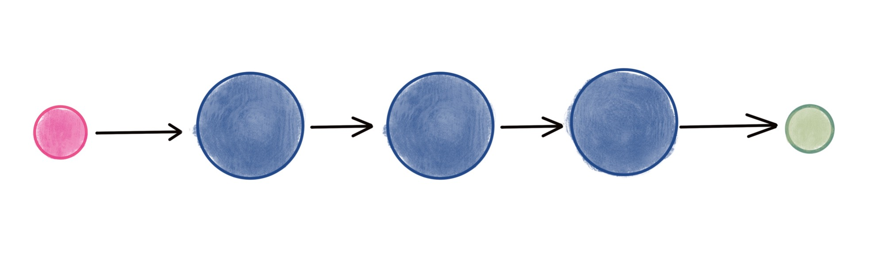

	- Dvojvrstvová - rieši napr. XOR
  
		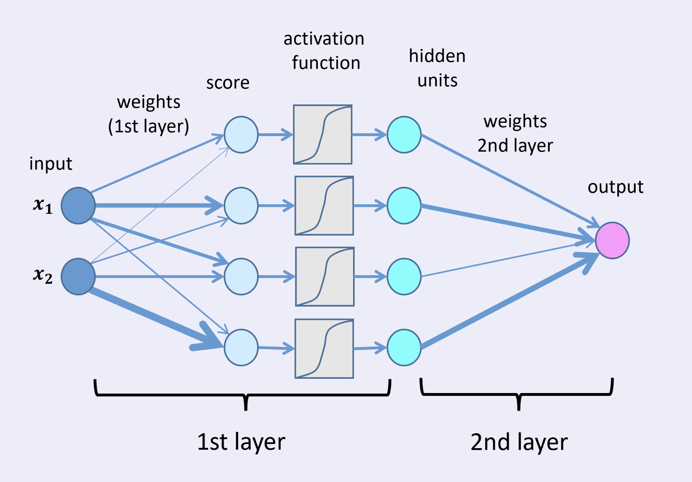 

	- Trojvrstvová - rieši napr. kategorizáciu obrázkov
	
		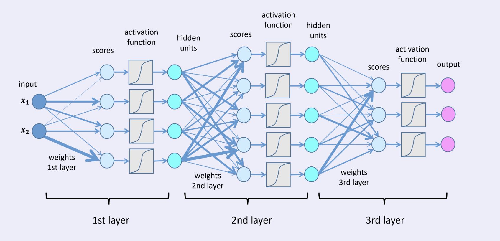 

### 3. Rekurentné siete (RNN - Recurent Neural Networks)
- Majú spätné spojenia, modelujú časové závislosti.  
- Použitie: text, časové rady, reč.  
- Pokročilé jednotky: LSTM, GRU — riešia dlhodobé závislosti.

	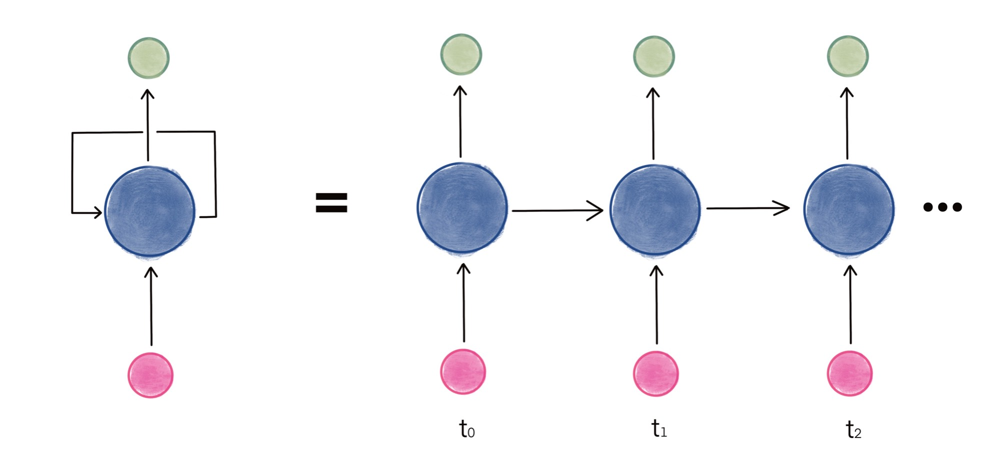

#### Sekvenčné spracovanie a skrytý stav

- Na rozdiel od CNN, ktoré sa orientujú na priestorové vzory, RNN pracujú so sekvenčnými dátami (časové rady, text, reč).

- Každý krok do seba vstup (napr. jeden znak alebo jeden časový údaj) a tiež prevezme skrytý stav z predchádzajúceho kroku, ten funguje ako krátkodobá pamäť pre predošlé informácie.
  
	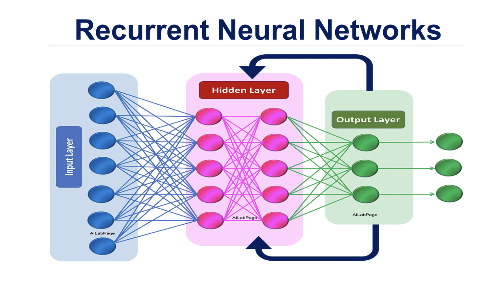

### 4. Konvolučné siete (CNN - Convolutional Neural Network)
- Určené najmä pre obrazové dáta.  
- **Konvolučné vrstvy:** Filtre extrahujú lokálne vzory (hrany, textúry, tvary).  
- Aplikácie: detekcia objektov, rozpoznávanie tvárí, segmentácia.
	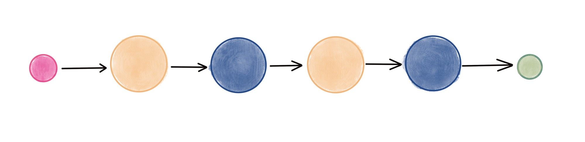

#### Hierarchická extrakcia rysov

- Na najnižších úrovniach sa filtrami zachytávajú základné elementy obrazu (hrany, rohy, plochy).

- V stredných vrstvách sa už spoja do zložitejších štruktúr (textúry, menšie tvary).

- V hlbších vrstvách vznikajú semantické celky (uši, oči, objekty).

#### Lokálna i translácia invariantná detekcia

- Každý filter pracuje iba na malej lokálnej oblasti (receptívne pole), čo umožňuje učiť sa miestne vzory.

- Keďže ten istý filter sa „posúva“ (sliduje) cez celý obraz, je schopný detegovať rovnaký vzor kdekoľvek – výsledok je translácia‑invariantný.
  - Filter obrázku:
  
	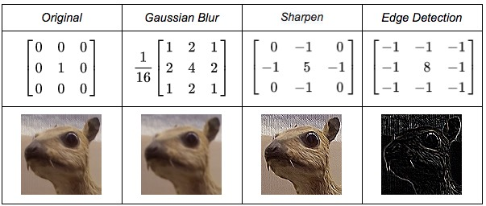

  - Process CNN
  
	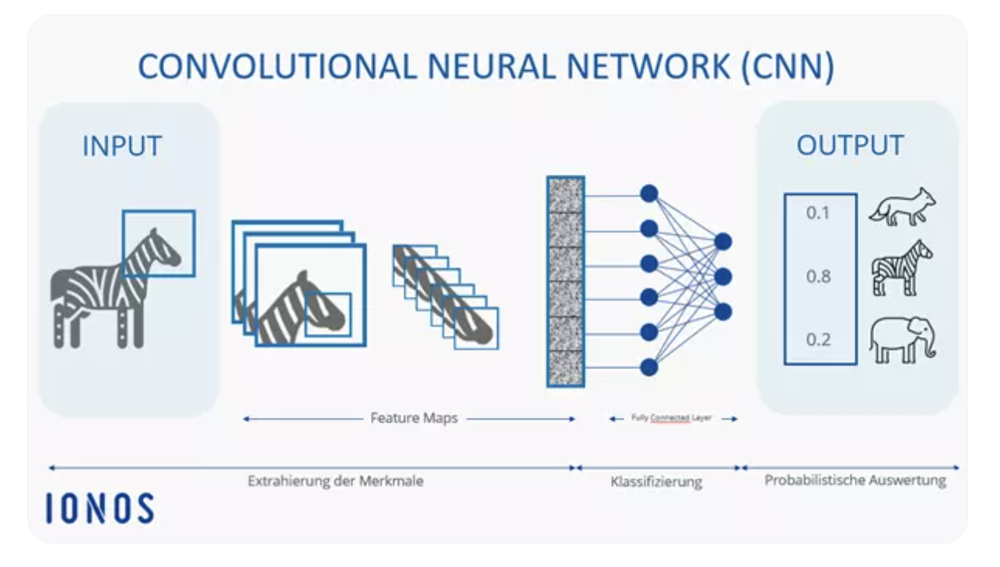

## Aplikácie
- **Klasifikácia obrazu:** Rozpoznávanie objektov.  
- **Predikcia časových radov:** Ekonomické dáta, senzory.  
- **NLP:** Strojový preklad, sentiment analýza.  
- **Reinforcement Learning:** AlphaGo, DeepMind Atari agent. 


| Typ siete                                 | Aplikácie                                                        |
|-------------------------------------------|------------------------------------------------------------------|
| **Feedforward Neural Network**            | Klasifikácia a regresia na tabulárnych dátach                    |
| **Deep Neural Network (DNN)**             | Extrakcia vlastností (feature learning), obrazová klasifikácia   |
| **Recurrent Neural Network (RNN)**        | Predikcia časových radov, spracovanie prirodzeného jazyka, reč    |
| **Convolutional Neural Network (CNN)**    | Rozpoznávanie a detekcia objektov, segmentácia obrazov, FaceID   |
