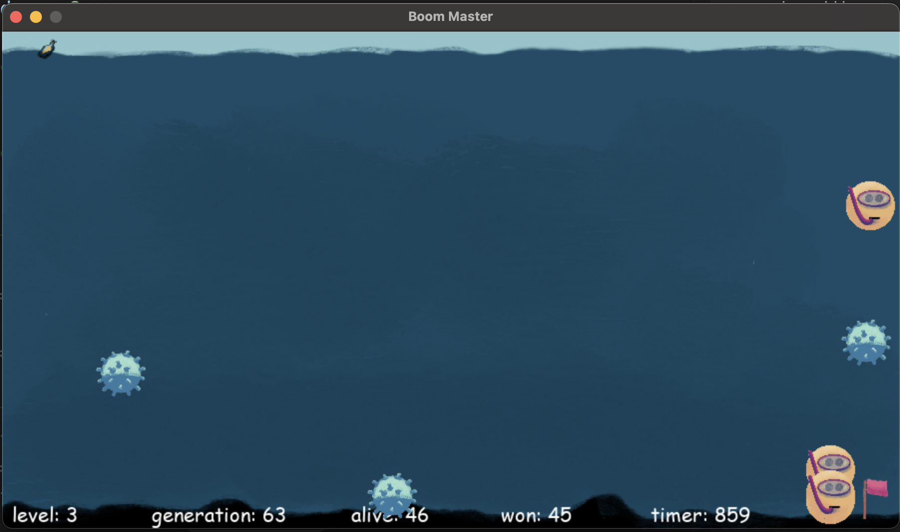
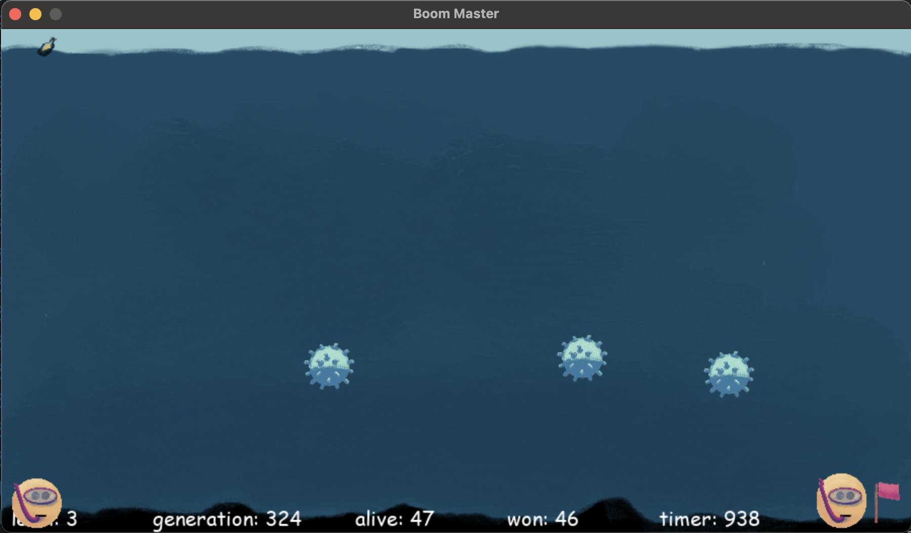
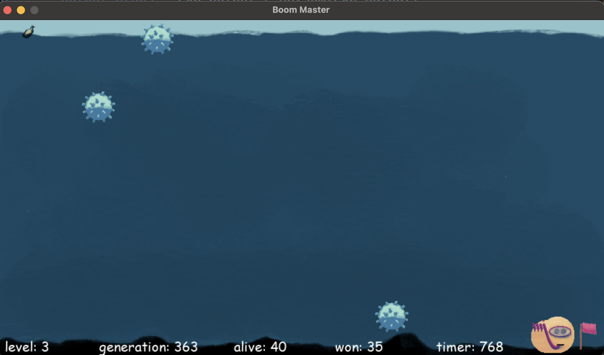
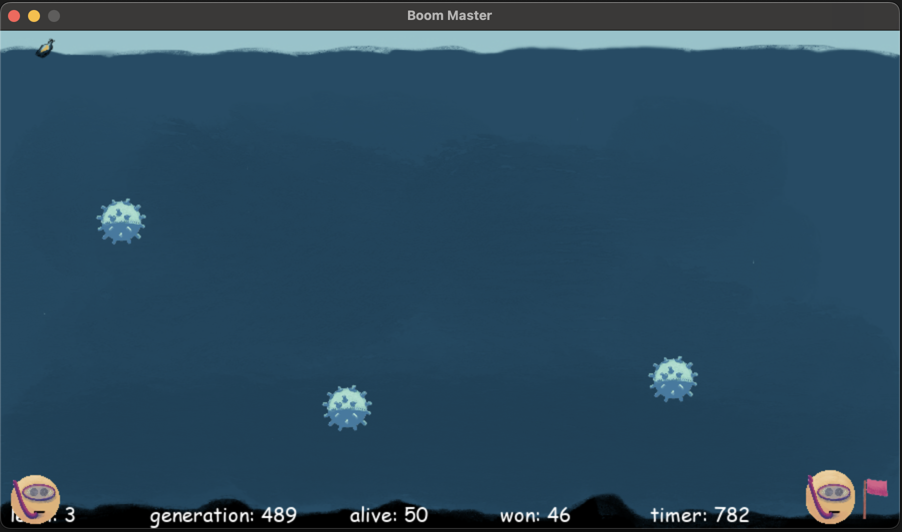

# Evolúcia Neurónovej Siete pre Navigáciu v Mínovom Poli

Tento projekt demonštruje použitie evolučných algoritmov na trénovanie neurónových sietí, ktoré riadia agenta pri navigácii mínovým poľom k cieľovej vlajke.

## Štruktúra Projektu

- `evolved_nn/` – Obsahuje implementáciu evolúcie neurónovej siete
  - `boom_evolve-empty.py` – Hlavný skript, ktorý spúšťa simuláciu a evolúciu
  - `constants.py` – Herné konštanty a parametre
  - `classes.py` – Triedy herných objektov
- `singleplayer/` – Obsahuje verziu hry pre manuálne hranie (pomocou WASD ovládania)
- `imgs/` – Obsahuje grafické prvky hry (míny, hráč, more, vlajka)

## Ako to Funguje

1. **Herné prostredie**: Prostredie tvorí more s náhodne rozmiestnenými mínami a cieľovou vlajkou.
2. **Agenti**: Viacero agentov (znázornených ako loďky) sa pohybuje v prostredí.
3. **Neurónová sieť**: Každého agenta ovláda neurónová sieť s:
   - 15 vstupmi (senzory mín, poloha vlajky, detekcia stien)
   - 8 neurónmi v skrytej vrstve s ReLU aktiváciou
   - 4 výstupmi (hore, dole, doľava, doprava)
4. **Evolúcia**: Neurónové siete sa vyvíjajú medzi generáciami:
   - Fitness funkcia odmeňuje agentov, ktorí sa rýchlo a efektívne dostanú k vlajke
   - Genetické operácie (výber, kríženie, mutácia) vytvárajú nové generácie
   - Najúspešnejšie siete odovzdávajú svoje „gény“ (váhy) ďalšej generácii

## Ako to Spustiť

1. Uisti sa, že máš nainštalovaný Python a tieto knižnice:
   - Pygame
   - NumPy
   - DEAP (Distributed Evolutionary Algorithms in Python)

2. Spusti simuláciu:
- Presuňte sa do zložky
```
cd p_06/uloha/evolved_nn 
```

- Spustite script
```
python3 boom_evolve-empty.py 
```

3. Sleduj evolučný proces:
- Sleduj, ako sa agenti učia vyhýbať mínam
- Na obrazovke sa zobrazuje aktuálny level, generácia, počet živých agentov a výhercovia

## Parametre

Rôzne parametre môžeš upraviť v súbore `boom_evolve-empty.py`:
- `VELIKOST_POPULACE` – Veľkosť populácie (počet agentov)
- `EVO_STEPS` – Počet krokov evolúcie
- `NGEN` – Počet generácií
- `CXPB` – Pravdepodobnosť kríženia
- `MUTPB` – Pravdepodobnosť mutácie
- `level` – Úroveň obtiažnosti (počet mín)

## Fitness Funkcia

Fitness každého agenta sa počíta na základe:
- Či sa dostal k vlajke (veľký bonus)
- Ako efektívne sa tam dostal (menej krokov = vyšší bonus)
- Ako blízko sa dostal k vlajke, ak ju nedosiahol
- Ako dlho prežil

## Zásluhy

Tento projekt demonštruje koncepty z oblastí:
- Evolučné algoritmy
- Neurónové siete
- Simulácie pomocou Pygame

## Ukážka

Na obrázkoch môžte vidieť level (počet mín), aktuálnu generáciu, čas od spustenia generácie, počet živých a víťazných potápačov (Me), míny (Mine) a vlajku (Flag)

To že sa potápači dostali do ciela ešte neznamená, že sú "perfektne múdri", mohli mať iba štastie pretože mapa je malá a míny sa nemuseli rozbehnúť priamo na nich. Takže čím väčší počet potápačov prežil ešte nevypovedá o ich múdrost - môže ísť iba o šťastie

### Generácia 63, prežilo 45 potápačov


### Generácia 324, prežilo 46 potápačov


### Generácia 363, prežilo 35 potápačov


### Generácia 489, prežilo 46 potápačov
