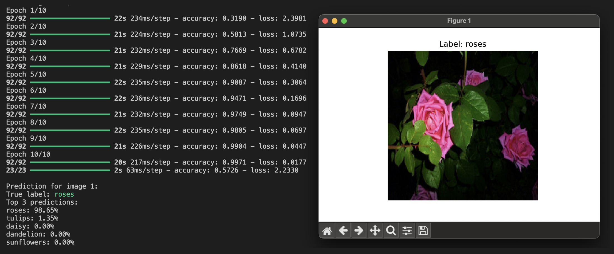
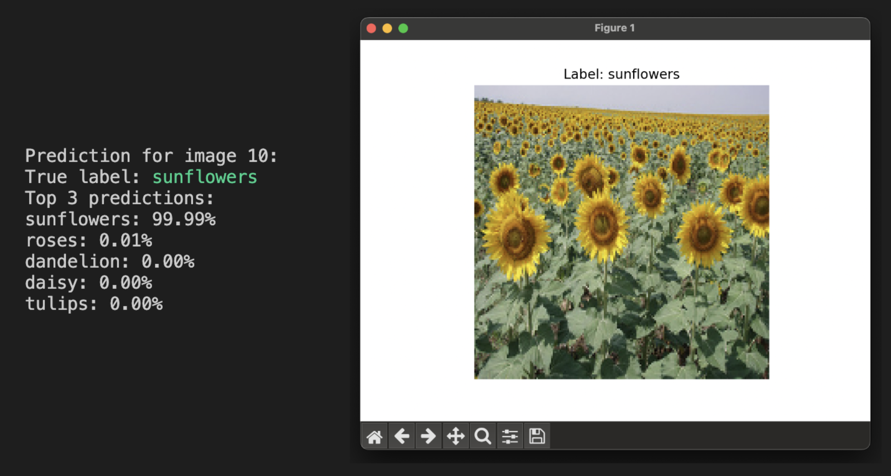
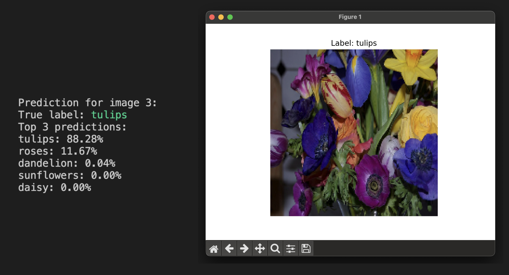

# Rozpoznávanie kvetov pomocou TensorFlow

Tento projekt implementuje Konvolučnú neurónovú sieť (CNN) na rozpoznávanie kvetov pomocou datasetu TensorFlow Flowers. Model dokáže klasifikovať obrázky do 5 rôznych kategórií kvetov.


## Štruktúra projektu

- `flowers_recognition.py` – Hlavný súbor obsahujúci implementáciu CNN modelu a logiku trénovania
- `constants.py` – Konfiguračný súbor obsahujúci parametre modelu a konštanty

## Funkcie

- Klasifikácia obrázkov pre 5 rôznych druhov kvetov
- CNN architektúra s viacerými konvolučnými vrstvami
- Predikcia v reálnom čase s hodnotami istoty
- Zobrazenie vzorových predikcií
- Tréningové a evaluačné metriky

## Požiadavky

- Python 3.x
- TensorFlow
- TensorFlow Datasets
- NumPy
- Matplotlib

## Inštalácia

1. Nainštalujte potrebné balíky:
```bash
pip install tensorflow tensorflow-datasets numpy matplotlib
```

## Použitie

Spustite hlavný skript:
```bash
python flowers_recognition.py
```

Skript vykoná:
1. Načíta a predspracuje dataset kvetov
2. Zobrazí vzorové obrázky z trénovacej sady
3. Natrénuje CNN model
4. Vyhodnotí model na testovacej sade
5. Zobrazí predikcie pre 10 náhodných testovacích obrázkov s hodnotami istoty

## Architektúra modelu

CNN model pozostáva z:
- Vstupnej vrstvy (180x180x3)
- Konvolučnej vrstvy (32 filtrov, 3x3 jadro)
- MaxPooling vrstvy
- Konvolučnej vrstvy (64 filtrov, 3x3 jadro)
- MaxPooling vrstvy
- Flatten vrstvy
- Dense vrstvy (128 neurónov)
- Výstupnej vrstvy (5 tried)

## Konfigurácia

Nasledujúce parametre je možné upraviť v súbore `constants.py`:
- `IMAGE_SIZE`: Rozmery obrázkov (predvolené: 180x180)
- `BATCH_SIZE`: Veľkosť trénovacích dávok (predvolené: 32)
- `EPOCHS`: Počet trénovacích epôch (predvolené: 10)
- `NUM_CLASSES`: Počet kategórií kvetov (predvolené: 5)

## Výstup

Program zobrazí:
- Ukážkové obrázky z datasetu
- Priebeh trénovania
- Evaluačné metriky modelu
- Predikcie testovacích obrázkov s:
  - Skutočnou triedou
  - Najlepšími predikciami a hodnotami istoty
  - Vizuálnym zobrazením obrázka

### Priebeh Epochs a rozoznanie obrázku - ruža



### Rozoznanie obrázku - slnečnica



### Rozoznanie obrázku - tulipán


